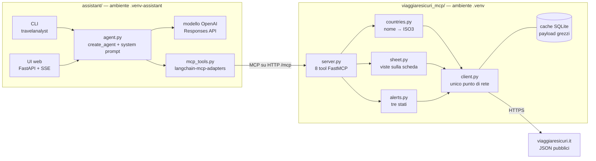
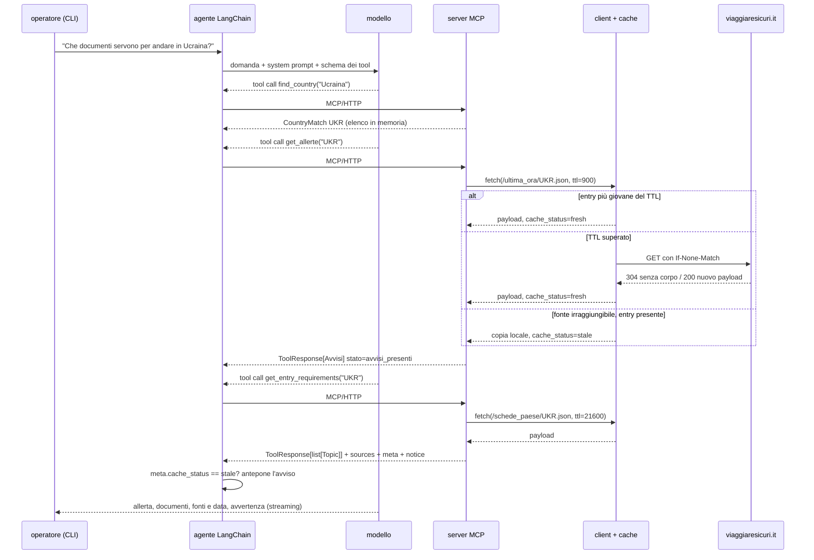

# TravelAnalyst

Un server MCP che espone come tool le schede paese e gli avvisi di viaggiaresicuri.it, e un
assistente LangChain per il customer care che risponde solo attraverso quei tool, citando fonte e data.



## Indice

1. [Quickstart](#quickstart)
2. [Sessione di esempio](#sessione-di-esempio)
3. [Copertura dei requisiti](#copertura-dei-requisiti)
4. [Architettura](#architettura)
5. [Flusso dei dati](#flusso-dei-dati)
6. [I tool MCP](#i-tool-mcp)
7. [Fonti e discovery](#fonti-e-discovery)
8. [Decisioni progettuali](#decisioni-progettuali)
9. [Comportamento in caso di errore](#comportamento-in-caso-di-errore)
10. [Agente proattivo (design)](#agente-proattivo-design)
11. [Assunzioni, limiti noti, non implementato](#assunzioni-limiti-noti-non-implementato)
12. [Struttura del repo](#struttura-del-repo)

## Quickstart

**Prerequisiti:** Python 3.11 o superiore (verificato su 3.12), `git`, accesso a
`www.viaggiaresicuri.it` e all'endpoint del modello. Docker solo se si vogliono le immagini.

**Due ambienti virtuali, non uno.** FastMCP 4 dipende da `mcp>=2`, `langchain-mcp-adapters` da
`mcp<2`: server e assistente si installano separati e parlano via HTTP.

```bash
git clone https://github.com/lorispalmarin/travelanalyst.git
cd travelanalyst

python3.12 -m venv .venv
.venv/bin/python -m pip install -e ".[server,dev]"

python3.12 -m venv .venv-assistant
.venv-assistant/bin/python -m pip install -e ".[assistant,dev]"

cp .env.example .env    # poi inserire OPENAI_API_KEY
```

Se `python3.12` non c'è, va bene qualunque interprete 3.11 o superiore. Il server non ha bisogno
di credenziali; l'elenco completo delle variabili, commentato, è in [.env.example](.env.example).

| Variabile | Default | Processo | Uso |
|---|---|---|---|
| `OPENAI_API_KEY` | — | assistente | **obbligatoria** |
| `OPENAI_MODEL`, `OPENAI_BASE_URL` | `gpt-5.6-luna`, vuoto | assistente | modello ed endpoint (vuoto = OpenAI; oppure Azure) |
| `MCP_SERVER_URL` | `http://127.0.0.1:8001/mcp` | assistente | dove trovare il server |
| `MCP_HOST`, `MCP_PORT` | `127.0.0.1`, `8001` | server | indirizzo di ascolto |
| `VS_CACHE_TTL_SECONDS`, `VS_ALERTS_TTL_SECONDS` | `21600`, `900` | server | soglia di rivalidazione: generale (6 h) e avvisi (15 min) |
| `VS_CACHE_PATH` | `var/cache.sqlite3` | server | file della cache |

**Avvio.** Il server in un terminale che resta aperto, poi una delle interfacce in un secondo
terminale. L'assistente si collega al server già avviato, non lo avvia né lo ferma.

```bash
.venv/bin/python server.py                 # terminale 1: MCP su http://127.0.0.1:8001/mcp
.venv-assistant/bin/travelanalyst          # terminale 2: CLI (/tool, /nuovo, /aiuto, /esci)
.venv-assistant/bin/travelanalyst-web      # oppure: UI web su http://127.0.0.1:8000
```

**Test.** Ogni ambiente esegue le proprie suite; `tests/conftest.py` salta quelle del
componente non installato.

```bash
# server, contratto, cache, client, normalizzazione (offline)
.venv/bin/python -m pytest -q -m "not network and not llm"
# assistente, integrazione HTTP fra i due processi, packaging (offline, nessuna chiamata al modello)
.venv-assistant/bin/python -m pytest -q tests/test_assistant.py tests/test_mcp_http.py tests/test_packaging.py
# sentinella sulla fonte reale: scarica e valida tutte le schede paese
.venv/bin/python -m pytest -q -m network
# eval sul modello vero: richiedono il server avviato e consumano credito
.venv-assistant/bin/python -m pytest tests/test_assistant_eval.py -m llm -s
```

`test_mcp_http.py` avvia un server di test con `.venv/bin/python` (variabile `MCP_TEST_SERVER_PYTHON`).

**Indice semantico.** Non c'è niente da ricostruire: la ricerca semantica è stata costruita e poi
rimossa, vedi l'[ADR 2](#adr-2-nessun-rag-decide-la-forma-del-contenuto).

**Docker.** Due immagini separate, collegate da una rete Docker:

```bash
docker build --build-arg COMPONENT=server -t travelanalyst-mcp .
docker build --build-arg COMPONENT=assistant -t travelanalyst-assistant .
docker network create travelanalyst-net
docker run -d --rm --name travelanalyst-mcp --network travelanalyst-net \
  -e MCP_HOST=0.0.0.0 -v travelanalyst-cache:/var/lib/travelanalyst \
  travelanalyst-mcp python -m viaggiaresicuri_mcp.server
docker run --rm --network travelanalyst-net -p 8000:8000 --env-file .env \
  -e MCP_SERVER_URL=http://travelanalyst-mcp:8001/mcp travelanalyst-assistant
```

## Sessione di esempio

Output della CLI del 13 settembre 2026, senza codici colore e con la domanda riportata dopo il
prompt `›` (arrivava da stdin). Le righe `→` sono le chiamate ai tool MCP. La domanda riguarda solo
i documenti: l'allerta in testa c'è perché l'agente ha deciso da solo di chiamare `get_allerte`.

```
connessione al server MCP…

Assistente Viaggiare Sicuri
gpt-5.6-luna via Responses API su api.openai.com · 8 tool · /aiuto per i comandi

› Che documenti servono per andare in Ucraina?
  → find_country
  → get_allerte
  → get_entry_requirements

**Avviso importante:** la Farnesina sconsiglia **assolutamente tutti i viaggi verso l’Ucraina, a qualsiasi titolo**, a causa della situazione di sicurezza e della minaccia di attacchi aerei su Kiev e sull’intero territorio. L’avviso è aggiornato al **18 agosto 2026**.

Per un cittadino italiano/UE, la scheda indica:

- **Passaporto obbligatorio**, con almeno **3 mesi di validità residua**.
- **Visto non necessario** per soggiorni inferiori a **90 giorni**. Per soggiorni superiori occorre rivolgersi agli Uffici diplomatico-consolari dell’Ucraina in Italia.
- Al confine possono essere richiesti i **dati biometrici, comprese le impronte digitali**.
- Per i **minori**, la scheda rimanda all’approfondimento ufficiale sui documenti per i viaggi all’estero: https://www.viaggiaresicuri.it/approfondimenti-insights/documentidiviaggio

**Doppia cittadinanza italiana e ucraina:** le autorità ucraine considerano la persona esclusivamente cittadina ucraina. Per uscire dall’Ucraina è richiesto un **passaporto ucraino valido**; il solo passaporto italiano non è sufficiente. I cittadini italiani di sesso maschile tra 18 e 60 anni con cittadinanza ucraina possono inoltre essere soggetti alla legge sulla mobilitazione e non poter lasciare il Paese.

**Fonti:**
- Requisiti di ingresso: https://www.viaggiaresicuri.it/find-country/country/UKR — aggiornato al **17 agosto 2026**.
- Avviso di sicurezza: https://www.viaggiaresicuri.it/find-country/country/UKR — aggiornato al **18 agosto 2026**.

Le informazioni sono di orientamento preliminare e possono variare: prima della partenza vanno verificate le indicazioni ufficiali applicabili al caso specifico. Non sostituiscono pareri legali o sanitari.
```

Nella stessa sessione la domanda successiva ("derubato del passaporto a Valona, chi contatto?") ha
chiamato solo `find_country` e `get_embassy_contacts`: recapiti del Consolato Generale copiati alla
lettera, link a `ALB_contactDetails.pdf`, nessuna chiamata a `get_allerte`, che non avrebbe cambiato nulla.

## Copertura dei requisiti

| Requisito | Dove è soddisfatto | Note |
|---|---|---|
| Requisiti di ingresso | `get_entry_requirements` → `infoRequisitiIngresso` | |
| Documenti di viaggio e visti | `get_entry_requirements`, filtri `passport`, `visa`, `minors` | |
| Sicurezza | `get_security_info` → `infoSicurezza`, incluse le normative locali | |
| Situazione sanitaria | `get_health_info` → `infoSituazioneSanitaria` | |
| Mobilità e trasporti | `get_local_transport` → `infoMobilita` | |
| Ambasciate e consolati | `get_embassy_contacts` → nodo `infoGenerali.Ambasciate-e-Consolati` + PDF dei soli recapiti | nessun endpoint dedicato: i recapiti stanno dentro l'HTML della scheda, vedi [Fonti e discovery](#fonti-e-discovery) |
| Allerte e avvisi in corso | `get_allerte` → `/ultima_ora/{ISO3}.json` | tre stati espliciti |
| Solo tool MCP come fonte | l'agente riceve **solo** i tool caricati da `load_mcp_tools` ([mcp_tools.py](assistant/mcp_tools.py)); il [system prompt](assistant/prompts.py) vieta la conoscenza generale | il vincolo sul modello è un'istruzione, non una garanzia: vedi limiti |
| LangChain e FastMCP | `create_agent` + `langchain-mcp-adapters` ([agent.py](assistant/agent.py)); `FastMCP` su HTTP ([server.py](viaggiaresicuri_mcp/server.py)) | |
| Disclaimer | campo `notice` in ogni risposta dei tool; il prompt impone di chiudere ogni risposta con l'avvertenza | |
| Verificabilità | `sources` (pagina, JSON, PDF), `updated_at`, `meta`; la CLI e la UI mostrano ogni chiamata ai tool | |
| Domande generali senza un Paese | — | **non coperte**: le guide tematiche non sono esposte, vedi [ADR 2](#adr-2-nessun-rag-decide-la-forma-del-contenuto) |
| Design dell'agente proattivo | [docs/PROACTIVE_AGENT.md](docs/PROACTIVE_AGENT.md) | solo design, non implementato |

## Architettura

**Server MCP** ([viaggiaresicuri_mcp/](viaggiaresicuri_mcp/)), l'unico componente che conosce la fonte.
- `server.py`: gli 8 tool, le istruzioni del server, gli errori tradotti in `ToolError` con codice.
- `countries.py`: nome → ISO3 (ISO3, ISO2, nome ufficiale italiano o un suo pezzo non ambiguo); con
  più corrispondenze restituisce i candidati.
- `sheet.py` e `alerts.py`: scheda validata con vista per sezione e fallback sul primo piano; avvisi
  con i tre stati e la frase pronta.
- `models.py` e `normalize.py`: il contratto Pydantic. Nei validator l'HTML diventa testo, i link sono
  estratti prima di togliere i tag, i rimandi fra sezioni finiscono in `see_also`. I nodi sconosciuti
  non rompono la validazione (`extra="allow"`).

**Client HTTP e cache.** `client.py` è l'unico punto di rete: timeout di 15 s, 3 tentativi con
backoff esponenziale, tetto alle connessioni, lock per URL, richieste condizionali, errori httpx
tradotti in eccezioni di dominio. `cache.py` è uno store SQLite dei **corpi grezzi** per URL, sotto
la normalizzazione: un cambio di parsing non invalida niente.

**Assistente** ([assistant/](assistant/)).
- `agent.py`: `create_agent` con `ChatOpenAI` e checkpointer in memoria; la risposta esce come flusso
  di eventi (ragionamento, chiamate ai tool, testo).
- `mcp_tools.py`: carica i tool dal server con `load_mcp_tools`; l'assistente non ne ha di propri.
- `prompts.py` e `freshness.py`: le regole su campi vuoti, allerte e citazioni; l'avviso di copia
  locale, anteposto dal codice e non dal modello.
- `cli.py` e `web.py`: REPL e pagina FastAPI con SSE, entrambe mostrano i tool chiamati.

**Offline.** `scripts/discovery/` (solo stdlib) contiene gli script di esplorazione della fonte;
`tests/fixtures/` payload reali registrati (schede, lista Paesi, avvisi). Nulla serve a runtime.

## Flusso dei dati

La domanda della sessione di esempio, passo per passo:

1. La CLI passa la domanda all'agente. Il modello sceglie `find_country("Ucraina")`, l'adapter la
   inoltra via HTTP e il server risolve `UKR` sull'elenco dei Paesi in memoria.
2. `get_allerte("UKR")`: il client serve l'entry in cache se ha meno di 15 minuti, altrimenti manda
   una GET condizionale (304 senza corpo o 200 con payload nuovo). `alerts.py` valida, ordina per
   `tsModifica` e calcola lo stato.
3. `get_entry_requirements("UKR")`: stesso percorso con TTL di 6 ore; `sheet.py` valida il contratto,
   applica i fallback e restituisce i 5 nodi della sezione.
4. A ogni risultato `agent.py` legge `meta.cache_status` e, se vale `stale`, emette l'avviso di copia
   locale prima del testo. Il modello compone allerta, documenti, fonti con data e avvertenza, e la
   CLI stampa in streaming.



## I tool MCP

| Tool | Cosa restituisce | Quando l'agente lo sceglie |
|---|---|---|
| `find_country(query)` | ISO3, oppure i candidati se il nome è ambiguo | per risolvere il Paese, di solito come primo passo |
| `get_entry_requirements(country, topics?)` | passaporto, visto, minori, dogana e valuta, altro | documenti, visti, cosa portare alla frontiera |
| `get_security_info(country, topics?)` | criminalità, terrorismo, rischi naturali, aree di cautela, avvertenze, normative locali | zone da evitare, rischi, farmaci, alcol, comportamenti puniti |
| `get_health_info(country, topics?)` | strutture sanitarie, malattie, avvertenze, vaccinazioni | vaccini, malattie, assicurazione sanitaria |
| `get_local_transport(country)` | mobilità | patente, guida, strade, trasporti pubblici |
| `get_embassy_contacts(country)` | recapiti di ambasciata e consolati + PDF dei soli contatti | un cliente in difficoltà, documenti persi o rubati |
| `get_practical_info(country)` | dati del Paese, informazioni utili, numeri di emergenza locali | valuta, fuso orario, prefissi, polizia e ambulanza |
| `get_allerte(iso3)` | avvisi in corso con stato e frase pronta | "posso partire adesso", richieste esplicite di avvisi, e ogni volta che un avviso cambierebbe la risposta; una sola chiamata per Paese nella conversazione |

**Principio di design.** Gli endpoint utili sono tre, ma un tool per endpoint restituirebbe la
scheda intera: nel censimento su 222 Paesi circa 4.900 token in mediana e 18.700 al massimo
([docs/schede-paese.md](docs/schede-paese.md)). I tool sono quindi **viste per sezione** su un
unico contratto, qualche centinaio di token ciascuna. Scendere al singolo nodo moltiplicherebbe i
tool; per restringere basta `topics`.

Con otto tool il modello sceglie leggendo le **docstring**, scritte come istruzioni operative: cosa
contiene la sezione e cosa no (droga e farmaci stanno sotto sicurezza, le domande su una malattia in
sé non sono coperte), quando `get_allerte` serve e quando è una chiamata sprecata. `find_country` è
volutamente severo, senza alias né fuzzy matching: "Olanda" o "Bali" le traduce il modello, e un
nome non riconosciuto torna come errore che chiede il nome ufficiale.

**L'envelope `meta`.** Ogni tool risponde con lo stesso involucro:

```python
class ToolResponse(BaseModel, Generic[T]):
    country: CountryRef | None     # nome, iso3, iso2
    topic: str
    data: T                        # list[Topic] oppure Avvisi
    updated_at: datetime | None    # data dichiarata dalla fonte
    sources: Source                # page, data (URL del JSON), pdf
    meta: Meta | None
    notice: str = DISCLAIMER

class Meta(BaseModel):
    last_updated: datetime | None  # updateDate della scheda, o l'avviso più recente
    retrieved_at: datetime         # ultimo scaricamento o ultima verifica con 304
    cache_status: Literal["fresh", "stale"]
    age_seconds: int
```

Citazione, data di aggiornamento e stato della cache sono campi dello schema, non righe del prompt.
Un campo non si dimentica: se il tool ha risposto, fonte e data ci sono. Un'istruzione di prompt
invece compete con tutte le altre e perde peso man mano che il contesto cresce. Con lo stesso
criterio `Topic.status` distingue `available` da `not_published`, `Topic.provenance` distingue
`detail` da `summary`, e `Avvisi.messaggio` contiene la frase già scritta per ciascuno dei tre stati.

## Fonti e discovery

Il sito è una SPA Angular: l'HTML non contiene i dati, e gli endpoint sono stati ricavati dalle
chiamate XHR nei bundle `/build/main.*.js`. Si parte da `/schede_paese/lista_nazioni.json` (222
Paesi con nome italiano, ISO3, ISO2); con l'ISO3 si arriva a scheda, avvisi ed export PDF. Più tardi
è emersa una documentazione ufficiale, `/contenuti/JSON.pdf` (footer del sito, novembre 2021):
elenca gli endpoint senza descriverne i campi, e in un punto è sbagliata, perché
`/approfondimenti/sicurezzaaerea.json` restituisce il contenuto di "Preparare un viaggio".

| Endpoint | Contenuto | Usato |
|---|---|---|
| `/schede_paese/lista_nazioni.json` | 222 Paesi: nome, ISO3, ISO2, coordinate | sì |
| `/schede_paese/{ISO3}.json` | `updateDate` + 7 sezioni, 28 nodi foglia | sì |
| `/ultima_ora/{ISO3}.json` | `{ultima_ora: [...], focus: [...]}` | sì |
| `/schede_paese/pdf/{ISO3}.pdf` | PDF della scheda | come link |
| `/schede_paese/pdf/{ISO3}_contactDetails.pdf` | PDF di una pagina con i soli recapiti | come link |
| `/ultima_ora/totale.json` | feed globale recente, troncato | no: non è un superset dei per-Paese |
| `/approfondimenti/{nome}.json` | guide tematiche non legate a un Paese | no, vedi ADR 2 |
| `/marker/marker_{ISO3}.json` | lista | no: sempre `[]` nei campioni |

**Anomalie.**
- **HTML dentro il JSON.** `contenuto` e `testo` sono HTML con entità non decodificate. I recapiti
  consolari esistono solo dentro `<a href="mailto:…">`, quindi i link si estraggono prima di togliere i tag.
- **`tsModifica` è una stringa** (`"1787042700"`). Si converte esplicitamente; se non è
  interpretabile `published_at` vale `null`.
- **Nodi presenti ma vuoti.** Nessun nodo manca mai, ma molti sono stringa vuota:
  `Documentazione-necessaria` in 222 Paesi su 222, `Aree-di-particolare-cautela` nel 37%. Vuoto non
  significa "nessun rischio", da qui `not_published`.
- **Array vuoti come caso normale.** `ultima_ora/ALB.json` pesa 28 byte, con entrambe le liste vuote.
- **`""` al posto di `null`** su `nazione` e `tipologia`. Lo stesso avviso ha una forma diversa in
  `totale.json` e nell'endpoint per Paese.

**ETag e Last-Modified.** Verificati il 13 settembre 2026 su lista Paesi, scheda ALB e avvisi ALB e
UKR: tutti espongono `etag`, `last-modified` e `cache-control: public,max-age=0`. La GET condizionale
sulla scheda ALB riceve `304` e zero byte (48.823 senza). Senza ETag il client usa `If-Modified-Since`.

**Cercato e non trovato.** Un endpoint per i recapiti di ambasciate e consolati: stanno solo nella
scheda e nel PDF `_contactDetails`. Un contratto d'uso per client automatici: `robots.txt` dice solo
`Allow: /`, senza limiti né cadenze. Uno storico degli avvisi: esiste solo lo stato attuale. Una
data per singola sezione: c'è solo come testo nel nodo `Cronologia-aggiornamenti`.

## Decisioni progettuali

### ADR 1. Tool granulari invece di un tool per endpoint

**Contesto.** Tre endpoint utili. La scheda intera costa migliaia di token e una conversazione su
due Paesi la carica due volte.
**Decisione.** Un solo contratto Pydantic per la scheda e sei tool che ne restituiscono una vista
per sezione, più `find_country` e `get_allerte`. Il taglio si ferma alla sezione, con `topics`
come filtro opzionale.
**Conseguenze.** Il contesto resta piccolo e il routing dipende dalle docstring, che vanno curate
come codice. Ci sono 8 tool da tenere coerenti invece di 3, e ogni nuova sezione della fonte
richiede una scelta esplicita su dove esporla. Oggi sono raggiungibili 20 dei 28 nodi: restano
fuori la cronologia degli aggiornamenti, le indicazioni per operatori economici,
`Documentazione-necessaria` (sempre vuoto) e il primo piano, che arriva solo come fallback.

### ADR 2. Nessun RAG: decide la forma del contenuto

**Contesto.** Le schede paese sono già indicizzate sugli assi delle domande (Paese × sezione).
Restavano le guide tematiche "Salute in viaggio" e "Documenti di viaggio", l'unico contenuto non
legato a un Paese, e su quelle era stata costruita una ricerca semantica con embedding.
**Decisione.** Tolta. Nessun retrieval semantico, da nessuna parte. Non è il formato a decidere
(anche le schede sono prosa HTML) ma la forma del contenuto. Misurate, le guide si sono rivelate un
catalogo di 52 sezioni con un nome parlante (`Dengue`, `Rabbia`, `Furto o smarrimento di
documenti`) e un sommario di circa 876 token, leggibile per intero. La ricerca semantica sbagliava
proprio dove una scelta per nome non può sbagliare: per "smarrimento del passaporto" metteva al
primo posto "Restituzione di carte identità italiane rinvenute all'estero".
**Conseguenze.** Sono spariti l'indice binario, lo script di ingestion e le dipendenze relative, e
il server non riceve più alcuna credenziale di modello. Il prezzo è che le domande generali senza
un Paese non hanno risposta, e il prompt obbliga a dirlo. La sostituzione naturale, due tool
`list`/`get` sulle sezioni delle guide, non è scritta.

### ADR 3. TTL unico, con rivalidazione condizionale

**Contesto.** I contenuti si muovono a ritmi diversi: requisiti d'ingresso a mesi, primo piano più
spesso, avvisi senza preavviso. Un TTL unico è sbagliato per qualcuno.
**Decisione.** Un TTL solo, 6 ore, configurabile, con un'unica eccezione (ADR 5). Scaduta la soglia
non si riscarica ma si chiede alla fonte se il contenuto è cambiato: `If-None-Match`, oppure
`If-Modified-Since`. Con un 304 il corpo resta e si aggiorna solo `retrieved_at`.
**Conseguenze.** Sopra la soglia il costo è un round trip, non un download, ma una scheda
modificata dieci minuti fa può essere servita nella versione di sei ore prima. TTL differenziati per
tipo di contenuto sarebbero preferibili; richiedono però la frequenza di cambiamento per sezione,
che la fonte non espone come campo, e restano rimandati.

### ADR 4. Il TTL non cancella l'entry: stale-if-error

**Contesto.** Una cache normale sfratta le entry scadute. La fonte però è un servizio pubblico che
può essere irraggiungibile proprio quando serve.
**Decisione.** Il TTL è una soglia di rivalidazione, non una scadenza: nessuna entry viene mai
cancellata. Se il refetch fallisce per errore di rete, timeout, 5xx o un 4xx diverso da 404, si
serve la copia locale con `cache_status="stale"` e la sua età. Senza copia l'errore è esplicito.
**Conseguenze.** L'assistente sopravvive a un'interruzione della fonte, ma non può farlo in
silenzio: l'avviso viene anteposto dal codice. C'è anche una ragione che non è uptime.
viaggiaresicuri.it è un'infrastruttura pubblica senza contratto d'uso per client automatici: un
agente che la interroga a ogni tool call scarica un costo su chi non ha firmato niente, per
contenuti che cambiano su scala di settimane. La fonte dichiara `public,max-age=0` con i validator,
cioè "rivalida, non riscaricare", e il client fa esattamente questo. Il limite, se non lo mette la
fonte, se lo deve mettere il client.

### ADR 5. Sulle allerte il TTL scende a 15 minuti

**Contesto.** I timestamp osservati dicono che gli avvisi cambiano di rado: `ultima_ora/UKR.json`
ha `last-modified` 18 agosto 2026, `ultima_ora/ALB.json` 27 luglio 2026, controllati il 13
settembre. Sei ore sarebbero statisticamente quasi innocue.
**Decisione.** 15 minuti lo stesso, come parametro della singola chiamata
(`client.fetch(path, ttl_seconds=...)`) e non come tabella di TTL.
**Conseguenze.** Non conta la frequenza ma l'asimmetria del costo d'errore. Una scheda vecchia di
sei ore non cambia quasi mai una risposta; "nessuna allerta" detto sei ore dopo la pubblicazione di
un avviso è il peggior errore che il sistema possa fare. La rivalidazione costa poco: il payload
vuoto pesa 28 byte e il 304 zero. Resta un'eccezione singola e dichiarata; la seconda
giustificherebbe l'infrastruttura dei TTL differenziati.

### ADR 6. Grounding per prevenzione strutturale, non un verificatore a runtime

**Contesto.** Il rischio principale non è un numero inventato, ma un silenzio della fonte che
diventa rassicurazione: nodo vuoto letto come "nessun rischio", lista vuota letta come "Paese
sicuro", copia vecchia letta come situazione attuale. La contromisura ovvia sarebbe un secondo
modello che giudica ogni risposta.
**Decisione.** Nessun judge. Le distinzioni stanno nello schema: `status="not_published"`,
`provenance="summary"`, `Avvisi.stato` a tre valori con la frase pronta, `meta.cache_status` con
l'avviso anteposto dal codice. Il prompt fa il resto: allerte in testa, numeri copiati alla lettera,
citazione e avvertenza.
**Conseguenze.** Zero costo e zero latenza a runtime, comportamento deterministico dove conta. Lo
schema non impedisce al modello di parafrasare male ciò che riceve. Questo lo controllano le eval,
con asserzioni su traccia dei tool e stringhe vietate, ma solo sui casi scritti e non su ogni
risposta in produzione.

## Comportamento in caso di errore

| Cosa succede | Come reagisce il sistema |
|---|---|
| Fonte irraggiungibile, entry in cache (di qualunque età) | Dopo 3 tentativi si serve la copia con `cache_status="stale"` e `age_seconds`; l'assistente antepone "Il sito Viaggiare Sicuri non è raggiungibile… copia locale recuperata il …" |
| Fonte irraggiungibile, cache vuota | `ToolError [source_unavailable]`. Nessun ripiego, e l'assistente non ha dati da cui rispondere |
| La fonte risponde 404 | `ToolError [not_found]`, **senza** ripiegare sulla copia: la fonte ha risposto, e mascherarlo nasconderebbe un cambio di contratto |
| JSON non valido, o scheda che non rispetta il contratto | `ToolError [unexpected_payload]`, meglio che mezza scheda |
| Paese non riconosciuto | `ToolError [country_not_found]` con l'invito a riprovare con il nome ufficiale italiano o l'ISO3; il modello traduce e riprova |
| Paese ambiguo ("Corea") | `find_country` restituisce i candidati; gli altri tool `ToolError [ambiguous_country]`; il prompt impone di chiedere all'operatore |
| Filtro `topics` inesistente | `ToolError [unknown_topic]` con i valori ammessi, invece di una lista vuota che sembrerebbe "non pubblicato" |
| Nodo vuoto nella scheda | `status="not_published"`; per 5 nodi si usa il primo piano con `provenance="summary"` |
| Tema non coperto (voli, prezzi, domande generali) | Nessun tool adatto; il prompt impone di dirlo in una riga senza rispondere a memoria |
| **Nessun avviso pubblicato** | `stato="nessun_avviso_pubblicato"`, messaggio: "…non riporta avvisi per X. Significa che la Farnesina non ha pubblicato avvisi, **non che il Paese sia sicuro**." |
| **Allerte servite in stale** | `stato="non_verificabile"` anche se la copia non ha avvisi, messaggio: "Non riesco a contattare la fonte ufficiale, quindi **non posso verificare** se ci sono avvisi in corso. L'ultima copia disponibile, del …, non ne riportava." |

Due distinzioni sono il motivo di tutto il resto. "Nessun avviso pubblicato" descrive la Farnesina,
non il Paese. Da una copia locale senza avvisi non segue che non ce ne siano adesso: in stale il
sistema dichiara di non poter verificare. Entrambe stanno nel dato del tool, non solo nel prompt.

## Agente proattivo (design)

Solo progettato, non implementato; il design completo è in [docs/PROACTIVE_AGENT.md](docs/PROACTIVE_AGENT.md).

- **Architettura:** scheduler → poller su `ultima_ora/{ISO3}` (riusa client e cache) → confronto con lo stato già visto → valutazione → outbox → dispatcher.
- **Scheduling a fasce di rischio:** Paesi caldi ogni 5 minuti (avvisi attivi o pratiche in partenza), tiepidi ogni ora, freddi ogni 12 ore. Il costo resta sostenibile grazie al 304 a zero byte.
- **Rilevamento:** `id` dell'avviso come chiave naturale. `id` nuovo → avviso nuovo; `tsModifica` avanzato → aggiornamento. Lo stato sta in una tabella nella stessa SQLite.
- **Deduplica e falsi positivi:** escalation-only (si rinotifica solo se la gravità sale), soglia con coda di revisione umana, tetto per Paese con passaggio a digest, finestra di quiete.
- **Canale:** outbox transazionale con chiave di idempotenza; email, Slack o webhook, con il PDF dei recapiti.
- **Metriche:** precision giudicata da chi riceve, time-to-detect (`first_seen − tsModifica`), duplicati soppressi.
- **Limite:** la fonte pubblica dopo aver verificato, quindi il rilevamento è rapido rispetto alla pubblicazione, non all'evento.

## Assunzioni, limiti noti, non implementato

**Assunzioni**
- Chi usa l'assistente è un operatore di customer care italiano; il viaggiatore è un cittadino italiano, per cui le schede sono scritte.
- viaggiaresicuri.it è l'unica fonte, anche per "completare".
- Il modello è `gpt-5.6-luna` via Responses API, su OpenAI o sull'endpoint Azure (`OPENAI_BASE_URL`).
- Il Paese si risolve sull'elenco ufficiale italiano; la traduzione dal parlato spetta al modello.
- Il server MCP gira in una rete fidata: niente autenticazione, ascolto su `127.0.0.1` per default.
- I TTL di 6 ore e 15 minuti sono scelte mie, non indicazioni della fonte.

**Limiti noti**
- La data citata è `updateDate` della scheda intera, non della sezione: nella fixture dell'Albania la scheda è di fine luglio 2026, ma la Situazione sanitaria risulta modificata l'ultima volta il 03/12/2025. In più `updateDate` è in UTC (`2026-07-30T22:00:00Z`), e il modello scrive 30 luglio dove la cronologia della fonte dice 31/07.
- Nessuna query cross-Paese e nessuno storico: "quali Paesi hanno allerte attive" non si può chiedere.
- "Solo tool MCP" è imposto dal prompt: il modello non ha altri strumenti, ma nulla gli impedisce di aggiungere conoscenza propria.
- Una scheda in JSON valido ma fuori contratto entra in cache prima della validazione e sostituisce la copia buona.
- L'elenco dei Paesi viene caricato una volta per processo: se all'avvio arriva da una copia stale, resta così fino al riavvio.
- Con cache vuota e fonte giù il tool restituisce un errore, ma il prompt non ha una regola su come riferirlo.
- La conversazione vive in memoria e si perde al riavvio. La UI web ha un solo thread condiviso fra tutti i browser e accetta una domanda alla volta.
- Le eval (13 casi più un test su due turni) le ho scritte io a partire dai difetti già trovati: sono copertura di regressione, non una misura indipendente della qualità.

**Valutato e non implementato**
- *Ricerca ibrida, BM25, reranking, query rewriting, vector database:* caduti insieme al RAG (ADR 2). Migliorare il retrieval su un corpus che non ne ha bisogno sarebbe stato ottimizzare la cosa sbagliata.
- *TTL differenziati:* preferibili, ma servirebbe la frequenza di cambiamento per sezione (ADR 3).
- *Judge a runtime:* una chiamata e una latenza in più per controllare a valle ciò che lo schema garantisce a monte (ADR 6).
- *Parsing dei PDF:* il contenuto si sovrappone al JSON; restano link da inoltrare.
- *Tool `list`/`get` sulle guide tematiche:* il sostituto giusto della ricerca semantica, non scritto.
- *Agente proattivo:* solo design. Manca la tabella degli avvisi già visti.

## Struttura del repo

```
server.py                  entry point del server MCP HTTP
viaggiaresicuri_mcp/       server: tool, contratto, normalizzazione, client, cache
assistant/                 agente LangChain, system prompt, CLI, UI web (static/)
tests/                     test offline, sentinella di rete, eval sul modello; fixtures/ con payload reali
scripts/discovery/         script di esplorazione degli endpoint (solo stdlib)
docs/                      approfondimenti per sezione, agente proattivo, mappa dei nodi, storico/ dei piani
Dockerfile                 immagine server o assistente (--build-arg COMPONENT)
pyproject.toml             dipendenze per extra, console script, configurazione pytest
.env.example               variabili d'ambiente commentate
```

I documenti in `docs/` approfondiscono singole sezioni. In caso di disallineamento fa fede questo file.
