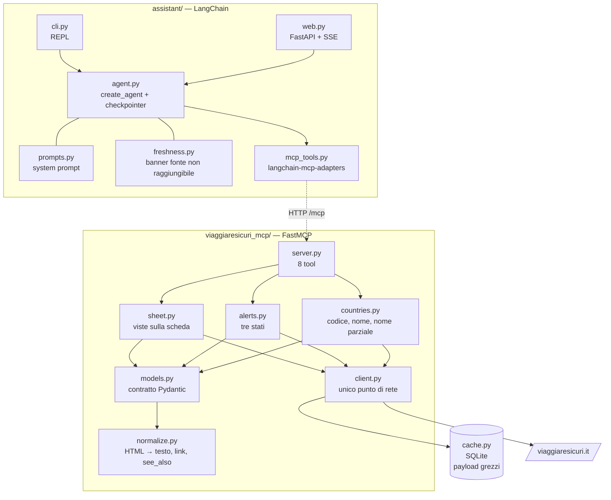
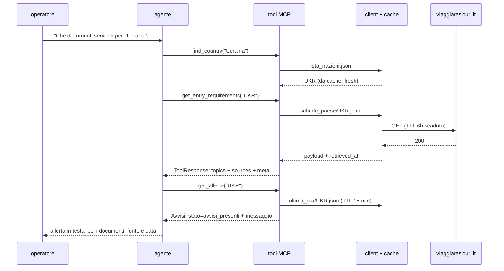

# Architettura

## I componenti



Il server MCP viene avviato indipendentemente con `python -m viaggiaresicuri_mcp.server`
o `python server.py`. Espone MCP su HTTP all'indirizzo `http://127.0.0.1:8001/mcp`.
L'assistente usa `MCP_SERVER_URL` per aprire la connessione, scoprire i tool e invocarli;
non avvia né arresta il server. `MCP_HOST` e `MCP_PORT` configurano l'ascolto del server.
Le variabili `VS_*` e la cache appartengono al processo server; le credenziali del modello
al processo assistente. Server e assistente hanno ambienti e immagini Docker separati: FastMCP 4 usa MCP 2,
mentre langchain-mcp-adapters usa MCP 1. Gli extra `server` e `assistant` non vanno installati
insieme. Il ponte HTTP usa `MultiServerMCPClient.session` e `load_mcp_tools`; gli errori dei
tool arrivano come `ToolMessage` con `status="error"`, i contenuti come blocchi testuali.


## Il percorso di una query



Tre proprietà che si vedono nel diagramma: la rete esiste in un punto solo; ogni risposta porta
con sé la propria provenienza; l'agente decide se chiedere le allerte, non lo fa per riflesso.

## Il design dei tool

| Tool | Sorgente | Costo tipico |
|---|---|---|
| `find_country(query)` | `lista_nazioni.json`: codice ISO3 o nome ufficiale | trascurabile |
| `get_entry_requirements(country, topics?)` | `infoRequisitiIngresso` | ~580 tok |
| `get_security_info(country, topics?)` | `infoSicurezza`, incluse le normative locali | ~1.330 tok |
| `get_health_info(country, topics?)` | `infoSituazioneSanitaria` | ~620 tok |
| `get_local_transport(country)` | `infoMobilita` | ~480 tok |
| `get_embassy_contacts(country)` | `infoGenerali.Ambasciate-e-Consolati` + PDF contatti | ~340 tok |
| `get_practical_info(country)` | dati Paese e numeri di emergenza locali | ~500 tok |
| `get_allerte(iso3)` | `ultima_ora/{ISO3}.json` | variabile |

**Perché non un tool per endpoint.** Gli endpoint sono tre: lista Paesi, scheda, avvisi. Un tool
per endpoint significherebbe restituire la scheda intera, e la scheda intera pesa in mediana
~4.600 token, fino a ~13.900 per l'India. Una conversazione che tocca due Paesi va fuori
controllo, e il modello deve cercare la risposta dentro un muro di testo.

Il taglio è per **sezione**, non più fine: una sezione costa poche centinaia di token, e dentro
`infoRequisitiIngresso` il modello distingue benissimo il passaporto dal visto. Scendere al nodo
avrebbe moltiplicato i tool senza far risparmiare niente.

Ne derivano tre effetti che contano più del risparmio di token. Il **contesto** resta pulito.
La **precisione del routing** aumenta: la docstring di ogni tool dice esplicitamente cosa contiene
e cosa no, ed è il solo meccanismo con cui il modello sceglie. La **disambiguazione** avviene
prima di toccare i dati: `find_country("corea")` non sceglie, restituisce i candidati e lascia
chiedere all'operatore.

Su questo la risoluzione fa **meno** di quanto sembri necessario, ed è una scelta. Riconosce un
codice ISO3, un nome dell'elenco, o un nome parziale non ambiguo — e per tutto il resto
fallisce, chiedendo il nome ufficiale. Non ci sono tabelle di alias né fuzzy matching: le une
traducevano dall'italiano parlato a quello ufficiale, l'altro perdonava i refusi, e entrambi i
lavori li fa meglio il modello che chiama il tool. Un fuzzy matcher esiste per gli errori di
battitura di una persona, e qui non digita nessuna persona. Con la misura a sostegno: nessuna
soglia separava i refusi veri (`tailandia` → `thailandia`, 95) dai falsi amici (`russia` →
`bielorussia`, 90), quindi la versione con le soglie rispondeva **Bielorussia** a chi chiedeva
della Russia.

Gli otto tool coprono 20 dei 28 nodi della scheda. Gli altri otto — la cronologia degli
aggiornamenti, le indicazioni per operatori economici e i cinque nodi di primo piano — non sono
esposti direttamente: il primo piano arriva come fallback quando il dettaglio è vuoto, il resto
non arriva. C'erano due tool generici che li raggiungevano; in tredici casi di eval il modello non
li ha scelti nemmeno una volta, quindi sono stati tolti. La conseguenza dichiarata sta nei limiti
noti del README.

## L'envelope `meta`, e perché non è una istruzione di prompt

Ogni tool risponde dentro lo stesso involucro:

```python
class ToolResponse(BaseModel, Generic[T]):
    country: CountryRef | None    # opzionale: oggi ogni tool parla di un Paese
    topic: str
    data: T
    updated_at: datetime | None   # updateDate della fonte
    sources: Source               # pagina web, endpoint JSON, PDF quando c'è
    meta: Meta | None             # last_updated, retrieved_at, cache_status, age_seconds
    notice: str = DISCLAIMER
```

Citazione, freschezza e stato della cache sono **campi dello schema**, non righe del system
prompt. La differenza è che un campo non si può dimenticare: se un tool risponde, la fonte c'è.
Un'istruzione di prompt invece compete con tutte le altre e perde quando il contesto si allunga.

Lo stesso principio vale dove conta di più. `Topic.status` vale `not_published` quando la fonte
non ha scritto nulla su quel punto — non è una stringa vuota che il modello può interpretare come
"nessun rischio". `Topic.provenance` vale `summary` quando il contenuto arriva dal primo piano
perché il dettaglio è vuoto. `Avvisi.messaggio` contiene la frase già scritta per i tre stati
degli avvisi, perché una distinzione di sicurezza non può dipendere da come il modello la
riformula.

`cache_status` e `age_seconds` chiudono il cerchio: quando la fonte non risponde e si serve una
copia locale, l'assistente antepone un avviso esplicito alla risposta ([freshness.py](../assistant/freshness.py)),
e la UI web lo rende come un blocco giallo sopra il testo. Mai una cache silenziosa.

## Una sola modalità di accesso

Tutto passa per chiave: Paese × sezione. Non c'è retrieval semantico da nessuna parte, ed è una
decisione misurata e non un'omissione — il ragionamento completo sta nell'ADR 2 di
[DECISIONS.md](DECISIONS.md).

In breve: le schede paese sono già indicizzate sugli assi su cui arrivano le domande, quindi un
embedding non aggiungerebbe nulla e toglierebbe determinismo. E le due guide tematiche, che
sembravano il caso buono per una ricerca semantica, si sono rivelate **un catalogo con un
sommario**: 52 sezioni con un nome parlante, `Dengue`, `Rabbia`, `Furto o smarrimento di
documenti`. Un catalogo si consulta, non si cerca.

La conseguenza da dichiarare è che quelle guide, per ora, restano fuori dalle fonti
dell'assistente: le domande generali che non nominano un Paese non hanno risposta, e il prompt
impone di dirlo invece di rispondere a memoria.

## Client HTTP e cache

Tutta la rete passa da [client.py](../viaggiaresicuri_mcp/client.py): timeout espliciti, tre
tentativi con backoff esponenziale, un tetto alle connessioni verso la stessa origine, e le
eccezioni di httpx tradotte in `SourceUnavailable`, `SourceNotFound`, `UnexpectedPayload` — così
nessun tool conosce la libreria di trasporto.

Sopra sta la cache, uno store SQLite di **payload grezzi** indicizzati per URL, sotto il livello
di normalizzazione: un cambio di parsing non invalida niente, e le entry restano utilizzabili come
fixture. La semantica è una sola, e non è quella di una cache-library:

```
entry presente, età < TTL   → si serve dalla cache, zero rete            (fresh)
entry presente, età ≥ TTL   → si rivalida in modo condizionale
                                304 → il corpo resta, si sposta la data  (fresh)
                                200 → si aggiorna e si serve             (fresh)
                                fonte giù → si serve la copia vecchia    (stale)
entry assente, refetch fallito → errore esplicito, nessun ripiego
```

**Il TTL è una soglia di rivalidazione, non una scadenza: nessuna entry viene mai cancellata.**
Se il sito è giù da otto ore e il TTL è sei, l'entry è ancora lì e viene servita, dichiarata.
L'ultimo caso è il solo in cui l'assistente non risponde, ed è deliberato: l'alternativa sarebbe
lasciar rispondere il modello a memoria su requisiti d'ingresso e rischi di sicurezza.

Superata la soglia **non si riscarica**: la entry porta con sé `etag` e `last_modified`, e la
richiesta diventa condizionale. Se la fonte risponde 304 il corpo non viene ritrasmesso e si
aggiorna solo `retrieved_at` — 9 ms e zero byte invece di 148 ms e 48 KB, misurato. Quella
distinzione è la parte interessante del contratto: `retrieved_at` è il momento dell'ultima
**verifica**, non dello scaricamento, mentre `last_updated` resta la data che dichiara la fonte.
Un terzo valore di `cache_status` tipo `revalidated` sarebbe stato facile da aggiungere e non
c'è: per l'agente il dato è fresco e confermato, e allargare un contratto per esporre un
dettaglio interno di trasporto non gli cambia una sola decisione.

Due dettagli con una ragione. Le richieste allo stesso URL sono serializzate da un lock per URL,
così una raffica di tool call non diventa una raffica di richieste alla fonte. E i 404 e i corpi
non-JSON **non** ripiegano sulla copia: sono la fonte che *risponde*, e mascherarli nasconderebbe
un cambio di contratto ai test sentinella.

Il perché di tutto questo — incluso il motivo etico, e il TTL da 15 minuti sugli avvisi — sta in
[DECISIONS.md](DECISIONS.md).
