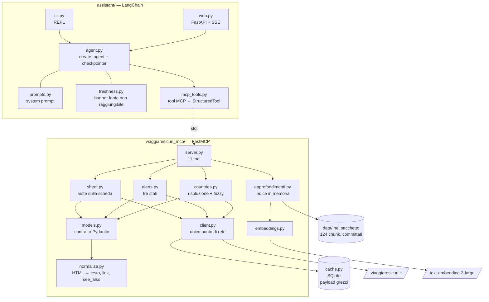
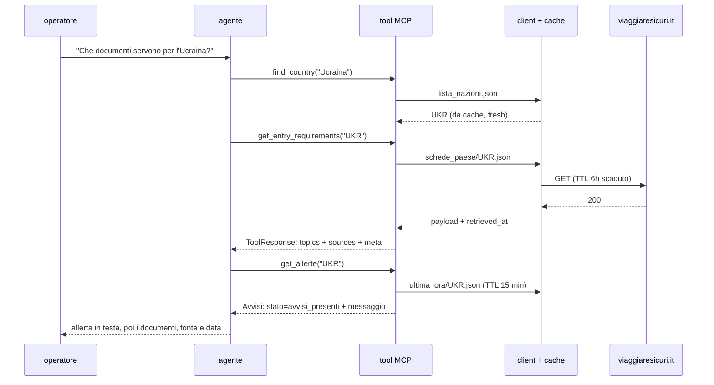

# Architettura

## I componenti



L'assistente avvia il server come sottoprocesso su stdio. Non lo importa: parla lo stesso
protocollo che parlerebbe Claude Desktop, quindi quello che funziona in CLI funziona in qualunque
client MCP.

Lo avvia come **modulo** (`python -m viaggiaresicuri_mcp.server`), non come file. È una
distinzione che sembra pedante e non lo è: un percorso ricavato da `__file__` funziona solo con
un'installazione editabile, dove il pacchetto sta accanto alla radice del progetto. Installato
normalmente — in un container, per esempio — il pacchetto è in `site-packages` e quel percorso
non esiste più. Per la stessa ragione l'indice semantico vive in `viaggiaresicuri_mcp/data/` ed è
dichiarato come package data: è un asset del pacchetto, non un file della cartella di lavoro.
`server.py` in radice resta, ma solo per i launcher esterni che vogliono un file da indicare.

## Il percorso di una query



Tre proprietà che si vedono nel diagramma: la rete esiste in un punto solo; ogni risposta porta
con sé la propria provenienza; l'agente decide se chiedere le allerte, non lo fa per riflesso.

## Il design dei tool

| Tool | Sorgente | Costo tipico |
|---|---|---|
| `find_country(query)` | `lista_nazioni.json` + fuzzy match | trascurabile |
| `get_entry_requirements(country, topics?)` | `infoRequisitiIngresso` | ~580 tok |
| `get_security_info(country, topics?)` | `infoSicurezza`, incluse le normative locali | ~1.330 tok |
| `get_health_info(country, topics?)` | `infoSituazioneSanitaria` | ~620 tok |
| `get_local_transport(country)` | `infoMobilita` | ~480 tok |
| `get_embassy_contacts(country)` | `infoGenerali.Ambasciate-e-Consolati` + PDF contatti | ~340 tok |
| `get_practical_info(country)` | dati Paese e numeri di emergenza locali | ~500 tok |
| `get_allerte(iso3)` | `ultima_ora/{ISO3}.json` | variabile |
| `list_country_topics(country)` | indice dei 28 nodi, senza testo | ~820 tok |
| `get_country_topics(country, keys)` | solo i nodi scelti | quanto pesano |
| `search_approfondimenti(query, top_k?)` | indice semantico | ~`top_k` × 500 tok |

**Perché non un tool per endpoint.** Gli endpoint sono tre: lista Paesi, scheda, avvisi. Un tool
per endpoint significherebbe restituire la scheda intera, e la scheda intera pesa in mediana
~4.600 token, fino a ~13.900 per l'India. Una conversazione che tocca due Paesi va fuori
controllo, e il modello deve cercare la risposta dentro un muro di testo.

Il taglio è per **sezione**, non più fine: una sezione costa poche centinaia di token, e dentro
`infoRequisitiIngresso` il modello distingue benissimo il passaporto dal visto. Scendere al nodo
avrebbe moltiplicato i tool senza far risparmiare niente.

Ne derivano tre effetti che contano più del risparmio di token. Il **contesto** resta pulito.
La **precisione del routing** aumenta: la docstring di ogni tool dice esplicitamente cosa contiene
e cosa no, ed è il solo meccanismo con cui il modello sceglie. La **disambiguazione** avviene
prima di toccare i dati: `find_country("corea")` non sceglie, restituisce i candidati e lascia
chiedere all'operatore.

I due tool sull'indice (`list_country_topics`, `get_country_topics`) sono la via d'uscita per le
domande che non stanno in nessun tema: mostrano i 28 nodi disponibili a costo basso e poi
recuperano solo quelli scelti, invece di far fallire la risposta.

## L'envelope `meta`, e perché non è una istruzione di prompt

Ogni tool risponde dentro lo stesso involucro:

```python
class ToolResponse(BaseModel, Generic[T]):
    country: CountryRef | None    # assente solo per la ricerca sugli approfondimenti
    topic: str
    data: T
    updated_at: datetime | None   # updateDate della fonte
    sources: Source               # pagina web, endpoint JSON, PDF quando c'è
    meta: Meta | None             # last_updated, retrieved_at, cache_status, age_seconds
    notice: str = DISCLAIMER
```

Citazione, freschezza e stato della cache sono **campi dello schema**, non righe del system
prompt. La differenza è che un campo non si può dimenticare: se un tool risponde, la fonte c'è.
Un'istruzione di prompt invece compete con tutte le altre e perde quando il contesto si allunga.

Lo stesso principio vale dove conta di più. `Topic.status` vale `not_published` quando la fonte
non ha scritto nulla su quel punto — non è una stringa vuota che il modello può interpretare come
"nessun rischio". `Topic.provenance` vale `summary` quando il contenuto arriva dal primo piano
perché il dettaglio è vuoto. `Avvisi.messaggio` contiene la frase già scritta per i tre stati
degli avvisi, perché una distinzione di sicurezza non può dipendere da come il modello la
riformula.

`cache_status` e `age_seconds` chiudono il cerchio: quando la fonte non risponde e si serve una
copia locale, l'assistente antepone un avviso esplicito alla risposta ([freshness.py](../assistant/freshness.py)),
e la UI web lo rende come un blocco giallo sopra il testo. Mai una cache silenziosa.

## Le due modalità di retrieval

| | Schede paese | Approfondimenti |
|---|---|---|
| Accesso | deterministico: Paese × sezione | semantico: coseno su 124 chunk |
| Struttura | 7 sezioni × 28 nodi, identiche in tutti i Paesi | prosa, gerarchia irregolare |
| Volume | 222 documenti, ~34 KB l'uno | 2 documenti, 230 KB in totale |
| Tool | i dieci tool sul Paese | `search_approfondimenti` |

**La regola che le separa non è il formato — sono entrambi JSON — ma la forma del contenuto e il
suo volume.** Le schede sono già indicizzate per gli stessi assi su cui arrivano le domande: c'è
una chiave per "Paese" e una per "requisiti di ingresso", quindi un embedding non aggiungerebbe
nulla e toglierebbe determinismo. Gli approfondimenti no: sono guide discorsive dove la risposta
a "cosa faccio se perdo il passaporto" sta in un paragrafo che non ha una chiave.

Il routing fra le due è affidato alle docstring, con un esempio negativo esplicito:
`search_approfondimenti` dichiara di servire le domande **non** legate a un Paese e cita il caso
da non sbagliare ("non usare per 'quali documenti servono per l'Albania'"). La eval verifica che
la separazione tenga sull'agente vero.

L'indice è una matrice numpy `(124, 3072)` caricata una volta all'avvio del server, non un vector
database: a questo volume il prodotto scalare su tutta la matrice è immediato, e una dipendenza in
più non avrebbe comprato niente.

## Client HTTP e cache

Tutta la rete passa da [client.py](../viaggiaresicuri_mcp/client.py): timeout espliciti, tre
tentativi con backoff esponenziale, un tetto alle connessioni verso la stessa origine, e le
eccezioni di httpx tradotte in `SourceUnavailable`, `SourceNotFound`, `UnexpectedPayload` — così
nessun tool conosce la libreria di trasporto.

Sopra sta la cache, uno store SQLite di **payload grezzi** indicizzati per URL, sotto il livello
di normalizzazione: un cambio di parsing non invalida niente, e le entry restano utilizzabili come
fixture. La semantica è una sola, e non è quella di una cache-library:

```
entry presente, età < TTL   → si serve dalla cache, zero rete            (fresh)
entry presente, età ≥ TTL   → si tenta il refetch
                                riuscito → si aggiorna e si serve        (fresh)
                                fallito  → si serve la copia vecchia     (stale)
entry assente, refetch fallito → errore esplicito, nessun ripiego
```

**Il TTL è una soglia di rivalidazione, non una scadenza: nessuna entry viene mai cancellata.**
Se il sito è giù da otto ore e il TTL è sei, l'entry è ancora lì e viene servita, dichiarata.
Il quarto caso è il solo in cui l'assistente non risponde, ed è deliberato: l'alternativa sarebbe
lasciar rispondere il modello a memoria su requisiti d'ingresso e rischi di sicurezza.

Due dettagli con una ragione. Le richieste allo stesso URL sono serializzate da un lock per URL,
così una raffica di tool call non diventa una raffica di richieste alla fonte. E i 404 e i corpi
non-JSON **non** ripiegano sulla copia: sono la fonte che *risponde*, e mascherarli nasconderebbe
un cambio di contratto ai test sentinella.

Il perché di tutto questo — incluso il motivo etico, e il TTL da 15 minuti sugli avvisi — sta in
[DECISIONS.md](DECISIONS.md).
