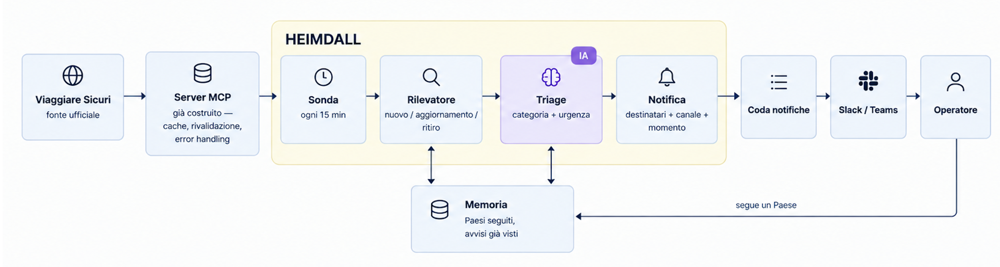

# Agente proattivo: Heimdall

Documento di design.

1. [L'idea](#1-lidea)
2. [Architettura](#2-architettura)
3. [Componenti](#3-componenti)
4. [Scheduling](#4-scheduling)
5. [Duplicati e falsi positivi](#5-duplicati-e-falsi-positivi)
6. [Canale di notifica](#6-canale-di-notifica)
7. [Limiti dichiarati](#7-limiti-dichiarati)

## 1. L'idea

L'assistente risponde quando un operatore chiede. Heimdall lavora al contrario: tiene d'occhio
gli avvisi della Farnesina sui Paesi dove l'agenzia ha clienti, e scrive all'operatore quando esce
qualcosa che deve sapere, senza aspettare una domanda.

| La traccia chiede un agente che… | Heimdall |
|---|---|
| monitora periodicamente le ultime notizie di un Paese | ogni 15 minuti legge il feed globale degli avvisi di Viaggiare Sicuri, una richiesta per tutti i Paesi; ogni ora ricontrolla i Paesi seguiti |
| rileva l'insorgere di possibili emergenze di sicurezza, sanitarie, naturali | distingue avvisi nuovi, aggiornamenti e ritiri; un modello classifica categoria e urgenza, e regole deterministiche possono solo alzare l'urgenza |
| allerta l'utente senza attendere un'interrogazione | scrive nel canale del team a chi segue quel Paese: subito se l'urgenza è immediata, altrimenti nel riepilogo del mattino |

**Per chi.** Gli operatori del customer care. Un operatore *segue* un Paese fino a una data, di
solito il rientro del cliente. Alla scadenza il seguito si chiude da solo.

**Cosa non fa.** Non contatta i clienti e non risponde a domande, che resta il mestiere
dell'assistente. Non usa fonti diverse da Viaggiare Sicuri: ogni notifica rimanda a un avviso della
Farnesina.

### Com'è una notifica

L'8 settembre alle 15:45 la Farnesina pubblica un avviso sull'Indonesia. Giulia segue l'Indonesia
fino al 20 settembre per un cliente in partenza per Bali. Al giro successivo della sonda, nel canale
del team:

```
🔴 Indonesia · naturale · immediata                          @Giulia · segue fino al 20/09

INDONESIA: ERUZIONE VULCANO KRAKATOA – SOSPENSIONE ATTIVITA’ AEROPORTUALI.
Data dell'avviso 08/09/2026 15:45 · rilevato alle 15:58

Sintesi: dopo l'eruzione del Krakatoa e gli incendi nel Borneo i collegamenti aerei con tutto
il Paese hanno ancora forti disagi; gli aeroporti riprendono lentamente e la Farnesina invita
a sentire la compagnia aerea o il tour operator.
  «i collegamenti aerei con l’intero Paese sono tuttora oggetto di forti disagi»

Avviso completo      https://www.viaggiaresicuri.it/find-country/country/IDN
Recapiti consolari   https://www.viaggiaresicuri.it/schede_paese/pdf/IDN_contactDetails.pdf

[ Utile ]  [ Non utile ]
Categoria, urgenza e sintesi sono generate da un sistema di IA e possono contenere errori:
fa fede il testo dell'avviso ufficiale.
```

Titolo, data e citazione vengono dall'avviso reale; la sintesi è un esempio. Se esce un
aggiornamento arriva come risposta in questo thread, con la menzione a Giulia; se l'avviso viene
ritirato, il thread e il riepilogo del mattino lo segnalano come «non più pubblicato».

### Quattro regole di comportamento

1. **Il triage decide quando, non se.** Ogni novità su un Paese seguito arriva a chi lo segue: il
   modello sceglie solo fra adesso e il riepilogo del mattino. Un suo errore costa ore di ritardo,
   non un avviso perso.
2. **La deduplica decide dove, non se.** Un aggiornamento va nel thread dell'evento invece che nel
   canale. Se il raggruppamento sbaglia, il messaggio finisce nel posto sbagliato, ma arriva.
3. **Il silenzio si dichiara.** Se la fonte o il server non rispondono, il canale lo sa: "nessuna
   allerta" non deve mai voler dire "non ho potuto guardare". È la stessa distinzione che
   l'assistente fa quando non può verificare.
4. **Nel messaggio fa fede la fonte.** Titolo, date, link e recapiti vengono dalla Farnesina; quello
   che scrive il modello è etichettato come tale e ancorato a una citazione verificata.

## 2. Architettura



Il giro, in cinque passi:

1. La **sonda** chiede gli ultimi avvisi al server MCP già costruito, che resta l'unico componente a
   parlare con la fonte: Heimdall eredita cache, rivalidazione e gestione degli errori senza
   riscriverle.
2. Il **rilevatore** confronta quello che vede con la memoria degli avvisi già visti e riconosce tre
   cose: avviso nuovo, aggiornamento di un evento noto, avviso ritirato. Quasi sempre non è cambiato
   niente e il giro finisce qui.
3. Il **triage** classifica le novità: categoria, urgenza e una sintesi breve.
4. La **notifica** guarda chi segue quel Paese e decide dove finisce il messaggio: canale, thread di
   un evento già segnalato, oppure riepilogo del mattino.
5. L'invio passa da una **coda**: si decide di notificare scrivendo una riga, non chiamando un
   servizio. Così un canale che non risponde non perde la notifica, e un riavvio non la manda due
   volte.

Heimdall è un processo a sé, accanto al server MCP e all'assistente, e ne è un client come
l'assistente: il server resta l'unico posto che conosce la fonte, e le due parti del progetto si
tengono insieme invece di essere due esercizi scollegati.

## 3. Componenti

| Componente | Cosa fa | La scelta |
|---|---|---|
| **Paesi seguiti** | un operatore segue un Paese fino a una data, con il riferimento della pratica | la scadenza chiude il seguito da sola: senza, il canale si riempie di Paesi che non interessano più |
| **Sonda** | ogni 15 minuti legge il feed globale degli avvisi, ogni ora ricontrolla i Paesi seguiti | passa dal server MCP e non dalla rete: una sola normalizzazione degli avvisi, per l'assistente e per Heimdall |
| **Memoria** | gli avvisi già visti e le notifiche già fatte | è l'unico stato del progetto, e serve perché la fonte pubblica solo il presente: lo storico degli avvisi non esiste, va costruito |
| **Rilevatore** | distingue avviso nuovo, aggiornamento e ritiro | ragiona per **evento** e non per singolo avviso: la Farnesina pubblica un aggiornamento come avviso nuovo che sostituisce il precedente, e sono quasi la metà degli avvisi in circolazione |
| **Triage** | assegna categoria (sicurezza, sanitaria, naturale, pratica) e urgenza (subito o riepilogo) | è l'unico punto in cui serve un modello: la categoria della fonte ha due valori e non distingue gli eventi naturali. La sintesi deve citare una frase dell'avviso, verificata alla lettera; i recapiti non passano mai dal modello |
| **Notifica** | sceglie destinatari, momento e posto del messaggio | raggruppa per giro e usa i thread, così il volume ha un tetto per costruzione |

Il modello entra in un punto solo, dove serve leggere un testo. Tutto il resto — cosa è cambiato, chi
avvisare, quando inviare — è deterministico, quindi prevedibile e verificabile.

## 4. Scheduling

- **Ogni 15 minuti il feed globale, ogni ora i Paesi seguiti.** Il feed elenca gli avvisi più recenti
  di tutti i Paesi: una richiesta sola dice cosa è comparso ovunque. Il giro orario sui Paesi seguiti
  serve a vedere gli avvisi *ritirati*, che nel feed non compaiono.
- **Perché 15 minuti:** è la stessa soglia con cui l'assistente rivalida gli avvisi, quindi chiedere
  più spesso restituirebbe la stessa copia. Il costo resta trascurabile perché la fonte risponde "non
  è cambiato niente" a zero byte.
- **Perché non fasce di frequenza per Paese**, con i Paesi a rischio interrogati più spesso: con un
  feed globale non servono, e sarebbero una regola in più da mantenere e da spiegare.
- **Quanto si aspetta:** al massimo un quarto d'ora dalla pubblicazione. È poco rispetto al ritardo
  che pesa davvero, quello fra l'evento e la pubblicazione della Farnesina.

## 5. Duplicati e falsi positivi

Valgono le prime due regole della § 1: il triage decide *quando* notificare, la deduplica *dove*, e
nessuno dei due decide *se*.

| Caso | Cosa fa Heimdall |
|---|---|
| lo stesso avviso rivisto a ogni giro | niente: è già in memoria |
| aggiornamento di un evento già segnalato | risposta nel thread di quell'evento, non un'allerta nuova |
| la stessa notizia pubblicata su più Paesi seguiti | un messaggio solo, con i Paesi raggruppati |
| avvisi già in corso quando si inizia a seguire un Paese | non diventano allerte: si vedono una volta, alla creazione del seguito |
| avviso ritirato dalla fonte | una riga nel riepilogo, scritta come "non più pubblicato", che non significa "rientrato" |
| avviso informativo, come l'assicurazione sanitaria o un cambio nelle regole sui visti | riepilogo del mattino, non allerta |
| fonte irraggiungibile | non si conclude niente, e Heimdall lo dichiara nel canale |

La direzione dell'errore è dichiarata: meglio un messaggio di troppo che uno mancato, perché
un'allerta inutile costa un minuto e una mancata può costare un cliente in viaggio verso un'area in
emergenza. Ma il volume ha un tetto — un messaggio per giro, aggiornamenti nei thread — perché un
canale rumoroso viene silenziato, e allora si perdono anche le emergenze.

## 6. Canale di notifica

Un canale della chat del team, Slack o Teams.

- È immediato ed è condiviso: chi è in turno vede anche i Paesi dei colleghi assenti.
- La menzione avvisa chi segue il Paese, senza messaggi privati da gestire.
- I thread tengono insieme gli aggiornamenti di uno stesso evento, che altrimenti sarebbero messaggi
  nuovi.


Il messaggio porta titolo e data della Farnesina, la sintesi generata e dichiarata come tale, il link
all'avviso e il PDF di una pagina con i recapiti consolari, che è quello che l'operatore inoltra al
cliente. Alle 08:30 un riepilogo raccoglie ciò che non era urgente: avvisi informativi, avvisi
ritirati, schede paese aggiornate, seguiti in scadenza.

## 7. Limiti dichiarati

- Heimdall rileva la **pubblicazione**, non l'evento: la Farnesina pubblica dopo aver verificato,
  quindi è veloce rispetto al sito, non rispetto alla notizia. In produzione affiancherei un segnale
  più rapido — agenzie, allerte meteo, sorveglianza epidemiologica — usato **solo** per alzare
  l'attenzione del team; quello che arriva al cliente continuerebbe a citare la Farnesina.
- Riconosce dal titolo che due avvisi parlano dello stesso evento: con un titolo riformulato può
  sbagliare, e allora il messaggio finisce nel canale invece che in un thread.
- Ha bisogno di una memoria propria, che è l'unico pezzo di stato del progetto: il server MCP oggi
  non ne ha, a parte la cache.
