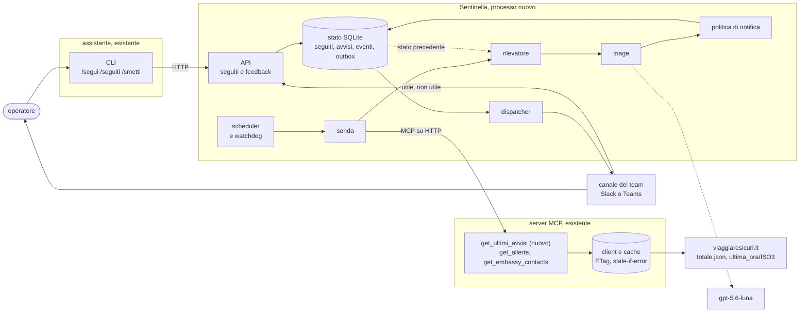

# Agente proattivo: la Sentinella

Documento di design. La traccia chiede il progetto dell'agente e lascia facoltativa
l'implementazione, che non è stata fatta. Le misure sulla fonte sono del 16 settembre 2026. La prima
versione del design, superata da questa, è in
[storico/agente-proattivo-prima-versione.md](storico/agente-proattivo-prima-versione.md).

1. [L'idea](#1-lidea)
2. [Cosa dice la fonte](#2-cosa-dice-la-fonte)
3. [Architettura](#3-architettura)
4. [Componenti](#4-componenti)
5. [Scheduling](#5-scheduling)
6. [Duplicati e falsi positivi](#6-duplicati-e-falsi-positivi)
7. [Canale di notifica](#7-canale-di-notifica)
8. [Valutazioni](#8-valutazioni)
9. [Piano di implementazione](#9-piano-di-implementazione)

## 1. L'idea

L'assistente risponde quando un operatore chiede. La Sentinella lavora al contrario: tiene d'occhio
gli avvisi della Farnesina sui Paesi dove l'agenzia ha clienti, e scrive all'operatore quando esce
qualcosa che deve sapere, senza aspettare una domanda.

| La traccia chiede un agente che… | La Sentinella |
|---|---|
| monitora periodicamente le ultime notizie di un Paese | ogni 15 minuti legge il feed globale degli avvisi di Viaggiare Sicuri, una richiesta per tutti i Paesi; ogni ora ricontrolla i Paesi seguiti |
| rileva l'insorgere di possibili emergenze di sicurezza, sanitarie, naturali | distingue avvisi nuovi, aggiornamenti e ritiri; un modello classifica categoria e urgenza, e regole deterministiche possono solo alzare l'urgenza |
| allerta l'utente senza attendere un'interrogazione | scrive nel canale del team a chi segue quel Paese: subito se l'urgenza è immediata, altrimenti nel riepilogo del mattino |

**Per chi.** Gli operatori del customer care. Un operatore *segue* un Paese fino a una data, di
solito il rientro del cliente, con un comando della CLI dell'assistente:
`/segui Indonesia 20/09 pratica-4812`. Alla scadenza il seguito si chiude da solo.

**Cosa non fa.** Non contatta i clienti e non risponde a domande, che resta il mestiere
dell'assistente. Non usa fonti diverse da Viaggiare Sicuri: ogni notifica rimanda a un avviso della
Farnesina.

### Com'è una notifica

L'8 settembre alle 15:45 la Farnesina pubblica un avviso sull'Indonesia. Giulia segue l'Indonesia
fino al 20 settembre per un cliente in partenza per Bali. Al giro successivo della sonda, nel canale
del team:

```
🔴 Indonesia · naturale · immediata                          @Giulia · segue fino al 20/09

INDONESIA: ERUZIONE VULCANO KRAKATOA – SOSPENSIONE ATTIVITA’ AEROPORTUALI.
Data dell'avviso 08/09/2026 15:45 · rilevato alle 15:58

Sintesi: dopo l'eruzione del Krakatoa e gli incendi nel Borneo i collegamenti aerei con tutto
il Paese hanno ancora forti disagi; gli aeroporti riprendono lentamente e la Farnesina invita
a sentire la compagnia aerea o il tour operator.
  «i collegamenti aerei con l’intero Paese sono tuttora oggetto di forti disagi»

Avviso completo      https://www.viaggiaresicuri.it/find-country/country/IDN
Recapiti consolari   https://www.viaggiaresicuri.it/schede_paese/pdf/IDN_contactDetails.pdf

[ Utile ]  [ Non utile ]
Categoria, urgenza e sintesi sono generate da un sistema di IA e possono contenere errori:
fa fede il testo dell'avviso ufficiale.
```

Titolo, data e citazione vengono dall'avviso reale; la sintesi è un esempio. Se esce un
aggiornamento arriva come risposta in questo thread, con la menzione a Giulia; se l'avviso viene
ritirato, il thread e il riepilogo del mattino lo segnalano come «non più pubblicato».

### Quattro regole di comportamento

1. **Il triage decide quando, non se.** Ogni novità su un Paese seguito arriva a chi lo segue: il
   modello sceglie solo fra adesso e il riepilogo del mattino. Un suo errore costa ore di ritardo,
   non un avviso perso.
2. **La deduplica decide dove, non se.** Un aggiornamento va nel thread dell'evento invece che nel
   canale. Se il raggruppamento sbaglia, il messaggio finisce nel posto sbagliato, ma arriva.
3. **Il silenzio si dichiara.** Se la fonte o il server non rispondono, il canale lo sa: "nessuna
   allerta" non deve mai voler dire "non ho potuto guardare". È la stessa distinzione che
   l'assistente fa con `non_verificabile`.
4. **Nel messaggio fa fede la fonte.** Titolo, date, link e recapiti vengono dalla Farnesina; quello
   che scrive il modello è etichettato come tale e ancorato a una citazione verificata.

## 2. Cosa dice la fonte

Prima di progettare ho misurato come si comportano davvero gli avvisi: i 223 file
`/ultima_ora/{ISO3}.json` e `/ultima_ora/totale.json`, scaricati il 16 settembre 2026 alle 18:12 e
confrontati con le copie in cache dei giorni 12–16. Sette fatti decidono il design; il resto del
documento li cita come F1…F7.

| | Fatto misurato | Conseguenza |
|---|---|---|
| **F1** | `totale.json` elenca i 25 avvisi più recenti di tutti i Paesi, dal più nuovo; al 16/09 coprono 29 giorni. Tutti e 25 coincidono per id, titolo e data con quelli dei file per Paese. Alla richiesta condizionale risponde 304 senza corpo. | Una richiesta basta per vedere cosa esce in tutto il mondo: non serve interrogare 223 Paesi a rotazione. |
| **F2** | Un aggiornamento è un avviso **con id nuovo**, che prende il posto del precedente. Canada, fra il 13 e il 16/09: sparisce `34711` "introduzione misure sanitarie di prevenzione", compare `35442` con lo stesso titolo più "aggiornamento". 43 avvisi attivi su 96 hanno "aggiornamento" nel titolo, e nessuno ha un id vecchio con una data recente, come succederebbe se l'id venisse riusato. | Deduplicare per id trasformerebbe ogni aggiornamento in un'allerta nuova. Serve un livello sopra l'avviso, l'**evento**, riconosciuto dalla radice del titolo. |
| **F3** | `tsModifica` è una data redazionale, arrotondata al quarto d'ora, e può precedere di molto la pubblicazione. Madagascar `35419`: datato 10/09 alle 10:45, file comparso alle 17:04. Perù `35228`: datato 1° luglio, con un id fra quelli usciti il 18 agosto. | Niente cursore temporale ("dammi ciò che è più recente dell'ultimo visto"): avrebbe perso il Perù. Le novità si trovano per differenza fra insiemi di id. |
| **F4** | `tipologia` ha due soli valori, `sicurezza` (76) e `sanita` (20). Gli avvisi su eventi naturali (16: terremoti, eruzioni, incendi, alluvioni, frane, tifoni) sono tutti `sicurezza`. La stessa notizia cambia etichetta da un Paese all'altro: Ebola è `sanita` in Congo, Malawi, Uganda e Zambia, `sicurezza` in Kenya, Ruanda e Tanzania. | Le categorie della traccia non si leggono dalla fonte: vanno ricavate dal testo. `tipologia` resta un indizio. |
| **F5** | La stessa notizia esce per più Paesi insieme: "SICUREZZA" per 7 Paesi del Golfo il 25/07 (id fra 35049 e 35056), "reperibilità carburante" per 6 Paesi il 23/06, lo stesso avviso con lo stesso testo per Israele e per i Territori Palestinesi. | I messaggi si raggruppano per giro della sonda, non per Paese. |
| **F6** | `Last-Modified` cambia anche quando il contenuto no. Nelle 24 ore prima del censimento 26 file per Paese risultano modificati, ma gli avvisi nuovi sono 5; Thailandia e Cina, confrontate con la cache, hanno ETag e contenuto identici. L'ETag è l'MD5 del contenuto (su `totale.json` coincide con `x-goog-hash`). | Si rivalida con l'ETag, come fa già il client, e si confrontano gli avvisi, mai le date dei file. |
| **F7** | Nessun canale push. L'HTML dichiara un feed RSS, `/assets/rss.xml`, che esiste ma è vuoto e fermo al 2 luglio 2026; nel bundle dell'app non ci sono websocket, `EventSource` né notifiche. | Il polling è l'unica strada, e `totale.json` è il feed che la fonte aggiorna davvero. |

## 3. Architettura



**Un giro, passo per passo.**

1. Lo **scheduler** avvia la **sonda** ogni 15 minuti e mezzo.
2. La sonda chiama `get_ultimi_avvisi` sul server MCP, che rivalida `totale.json` con l'ETag. Quasi
   sempre la risposta è 304, e il giro finisce qui.
3. Il **rilevatore** confronta gli id ricevuti con lo stato: gli id mai visti diventano avvisi
   nuovi, oppure versioni nuove di un evento già noto.
4. Il **triage** classifica ogni versione nuova: il modello propone categoria, urgenza, area e
   sintesi, e le regole sul titolo possono alzare l'urgenza.
5. La **politica di notifica** incrocia i cambiamenti con i seguiti attivi e sceglie per ciascuno:
   voce nel messaggio del giro, risposta in un thread, riga nel riepilogo, oppure niente se il
   Paese non è seguito.
6. Lo stato aggiornato e le notifiche da inviare si scrivono nella **stessa transazione**.
7. Il **dispatcher** invia al canale e salva il riferimento del messaggio, che serve ai thread
   successivi.

Un secondo giro, ogni ora, chiama `get_allerte` sui soli Paesi seguiti: il feed mostra gli avvisi
che compaiono, non quelli ritirati.

**Dove gira.** Un terzo processo, `travelanalyst-sentinella`, accanto a server e assistente, con
un'immagine dallo stesso Dockerfile (`--build-arg COMPONENT=sentinella`). È un client del server MCP
come l'assistente: stesse dipendenze e stesse credenziali del modello, che la traccia riserva appunto
ad assistente e agente. Lo stato è un file SQLite suo, `var/sentinella.sqlite3`, separato dalla cache
del server: la cache si può cancellare in qualsiasi momento, lo storico di cosa è stato notificato a
chi no.

**Cosa esiste e cosa manca.**

| Pezzo | Stato |
|---|---|
| Client HTTP, cache, rivalidazione con ETag, stale-if-error ([client.py](../viaggiaresicuri_mcp/client.py)) | esiste: la sonda lo eredita passando dal server |
| Validazione e normalizzazione degli avvisi: HTML in testo, `tsModifica` in data, `""` in `null` ([models.py](../viaggiaresicuri_mcp/models.py)) | esiste: la Sentinella non scrive parser |
| `get_allerte`, `get_embassy_contacts`, `find_country` | esistono |
| `get_ultimi_avvisi` su `totale.json` | nuovo, nel server |
| Sonda, rilevatore, triage, politica, outbox, dispatcher, API | nuovi, pacchetto `sentinella/` |
| Comandi `/segui`, `/seguiti`, `/smetti` | nuovi, nella CLI dell'assistente |

## 4. Componenti

### 4.1 Seguiti

Un seguito è una riga: Paese, operatore, data di fine, nota. Si gestisce dalla CLI dell'assistente,
che chiama l'API HTTP della Sentinella.

```
› /segui Perù 30/09 pratica-4812
Segui Peru' fino al 30/09/2026 (pratica-4812): le novità arriveranno in #avvisi-viaggio.
La fonte è stata consultata adesso e riporta 6 avvisi in corso per Peru'.
  01/09  PERU’: STATO DI EMERGENZA NELL'AREA METROPOLITANA DI LIMA E NELLA PROVINCIA COSTITUZIONALE DI CALLAO
  27/08  PERU': STATO DI EMERGENZA NEI DISTRETTI DI VILLA EL SALVADOR E VILLA MARÍA DEL TRIUNFO.
  18/08  PERU': stato di emergenza post sisma in 17 Distretti di Huancavelica e Junín.
  18/08  PERU': chiusura al traffico di un tratto della Panamericana Sud (Atico-Ocoña).
  23/07  PERU': stato di emergenza in cinque Distretti di Junín.
  01/07  PERU': STATO DI EMERGENZA NELLA PROVINCIA DI LIMA METROPOLITANA E NELLA PROVINCIA COSTITUZIONALE DEL CALLAO.
```

- Il Paese si risolve con `find_country`, con le stesse regole dell'assistente: se è ambiguo si
  chiede.
- La data è facoltativa: di default 30 giorni, al massimo 180. Il giorno prima della scadenza il
  riepilogo lo ricorda.
- Gli avvisi già in corso compaiono nella risposta al comando e non diventano allerte nel canale.
- L'operatore è l'email in `TRAVELANALYST_OPERATORE`; l'adattatore del canale la traduce
  nell'utente da menzionare.
- `nota` contiene solo il riferimento della pratica, mai dati del cliente.

Perché un comando e non un tool che l'assistente chiama da una frase come "avvisami se succede
qualcosa in Perù": il server MCP resta in sola lettura su una fonte pubblica, e un'azione con effetti
la decide l'operatore scrivendola, non un modello interpretandola.

### 4.2 Scheduler e watchdog

Un solo processo asyncio con APScheduler; l'API FastAPI gira nello stesso event loop.

| Job | Quando | Cosa fa |
|---|---|---|
| `giro_feed` | ogni 930 s | `get_ultimi_avvisi`, poi rilevatore |
| `giro_seguiti` | ogni ora, richieste distanziate | `get_allerte` per ogni Paese seguito, poi rilevatore |
| `dispatcher` | ogni 10 s | invia le notifiche in attesa |
| `riepilogo` | alle 08:30, ora italiana | il messaggio del mattino |
| `scadenze` | alle 08:00 | chiude i seguiti scaduti |
| `watchdog` | ogni 5 min | controlla l'ultimo giro riuscito |

- **Watchdog.** Tre giri del feed falliti di fila, circa 45 minuti, producono un messaggio di
  sospensione nel canale; il primo giro riuscito, un messaggio di ripresa e un `giro_seguiti`
  immediato. Un giro è fallito se il tool risponde con un errore o se serve una copia stale.
- **Chi sorveglia la Sentinella.** A ogni giro riuscito parte un ping verso un monitor esterno (dead
  man's switch). Se il processo si ferma, il suo silenzio è indistinguibile da una giornata
  tranquilla: deve accorgersene qualcun altro.
- **Una sola istanza.** Un lease in SQLite, rinnovato a ogni giro: durante un deploy la seconda
  istanza aspetta invece di inviare in doppio.

### 4.3 Sonda e `get_ultimi_avvisi`

La sonda è un client MCP su HTTP verso `MCP_SERVER_URL`, come
[mcp_tools.py](../assistant/mcp_tools.py), ma chiama i tool direttamente, senza modello. Ogni
chiamata diventa un'**osservazione**: gli avvisi (id, Paese, titolo, testo normalizzato, data,
`tipologia`), gli aggiornamenti di scheda, `cache_status`, e se l'osservazione è **completa** (il file
di un Paese, che mostra anche i ritiri) o **parziale** (il feed, che mostra solo le comparse).

- Un'osservazione `stale` non entra nel confronto: una copia locale non prova né che un avviso sia
  nuovo né che sia stato ritirato.
- Un errore del tool non diventa mai un'osservazione vuota, che il rilevatore leggerebbe come
  "ritirati tutti".

**Il tool nuovo.** `get_ultimi_avvisi` legge `/ultima_ora/totale.json`, il cui percorso è già in
[config.py](../viaggiaresicuri_mcp/config.py), e risponde con lo stesso `ToolResponse` degli altri
tool:

- `avvisi`: la lista `ultima_ora`, validata con il modello `Alert` esistente;
- `aggiornamenti_schede`: da `aggiornamentiSchedaPaese`, con Paese, data e sezioni cambiate (il
  titolo della voce è l'elenco: "Requisiti di ingresso, Sicurezza"). L'id di queste voci è per Paese
  (`AGGIORNAMENTO_SCHEDA_CHN`), non per aggiornamento, quindi la chiave è la coppia Paese e data;
- `focus` si ignora: contiene una sola voce, del 2023, non legata a un Paese.

Usa il TTL degli avvisi, 15 minuti: è lo stesso contenuto su un altro endpoint, non una seconda
eccezione all'ADR 5. `Meta` guadagna `source_last_modified`, già salvato in cache, che serve a
misurare il time-to-detect.

Il tool non va all'assistente: [mcp_tools.py](../assistant/mcp_tools.py) lo esclude per nome. Letta
da un modello, una lista troncata a 25 voci diventa facilmente "il Paese non ha avvisi"; aprirla
all'assistente richiede un caso d'uso e un'eval suoi.

### 4.4 Rilevatore

Una funzione pura, `rileva(stato, osservazione) -> list[Cambiamento]`: niente rete, niente modello,
si testa con i payload reali.

| Cambiamento | Condizione | Esempio reale |
|---|---|---|
| `Nuovo` | id mai visto, nessun evento del Paese con la stessa radice negli ultimi 30 giorni | `35404`, eruzione del Krakatoa |
| `Aggiornamento` | id mai visto, stessa radice di un evento del Paese aperto o ritirato da meno di 30 giorni | `35442`, Canada, che sostituisce `34711` |
| `Modifica` | id noto, testo diverso (hash) | mai osservata; supportarla costa poche righe |
| `Assenza`, poi `Ritiro` | un avviso attivo manca da un'osservazione completa; al secondo giro consecutivo è un ritiro | `35282`, Thailandia, inondazioni nel nord: nella fixture dei test, ritirato intorno all'11/09 |
| `SchedaAggiornata` | coppia Paese e data mai vista | Croazia, 11/09: Sicurezza |

**La radice del titolo**: minuscole, senza accenti né punteggiatura, senza il prefisso del Paese fino
al primo `:` o `–`, senza tutto ciò che segue "aggiornamento".

```
CANADA: introduzione misure sanitarie di prevenzione.
CANADA: introduzione misure sanitarie di prevenzione - aggiornamento.
    → introduzione misure sanitarie di prevenzione

UGANDA: malattia da virus Ebola (ceppo Bundibugyo) - aggiornamento nuove procedure.
    → malattia da virus ebola ceppo bundibugyo
```

Sui 96 avvisi attivi nessun Paese ne ha due con la stessa radice: coerente con F2, l'aggiornamento
prende il posto del precedente invece di affiancarlo.

```python
def rileva(stato: Stato, oss: Osservazione) -> list[Cambiamento]:
    cambiamenti = []
    for avviso in oss.avvisi:
        noto = stato.avviso(avviso.id)
        if noto is None:
            evento = stato.evento_recente(avviso.iso3, radice(avviso.titolo), giorni=30)
            cambiamenti.append(Aggiornamento(avviso, evento) if evento else Nuovo(avviso))
        elif noto.hash_testo != hash_testo(avviso):
            cambiamenti.append(Modifica(avviso, noto))
    if oss.completa:
        presenti = {a.id for a in oss.avvisi}
        for attivo in stato.avvisi_attivi(oss.iso3):  # esclusi quelli già sostituiti
            if attivo.id not in presenti:
                cambiamenti.append(Assenza(attivo))   # Ritiro alla seconda assenza di fila
    return cambiamenti
```

Tre invarianti:

- confronta insiemi di id, mai date (F3);
- non ritira un avviso su un'osservazione parziale, stale o isolata (F6);
- registra gli avvisi di tutti i Paesi del feed, anche di quelli non seguiti. Chi inizia a seguire un
  Paese trova lo storico già pronto, ed è anche lo storico degli avvisi che la fonte non conserva
  ([Fonti e discovery](../README.md#fonti-e-discovery)).

### 4.5 Triage

Una chiamata al modello per ogni versione nuova di un avviso, in qualunque Paese: almeno 29 nei 30
giorni al 16/09, 5 il 16 settembre. Stesso modello e stesso endpoint dell'assistente, con output
strutturato (`with_structured_output` di LangChain).

**Ingresso**: titolo; testo normalizzato (mediana 1.048 caratteri, massimo 7.500); Paese;
`tipologia`, presentata al modello come indizio inaffidabile.

**Uscita**:

```python
class Triage(BaseModel):
    categoria: Literal["sicurezza", "sanitaria", "naturale", "pratica"]
    urgenza: Literal["immediata", "riepilogo"]
    area: str | None   # "nord del Paese", "Lima e Callao"; None se riguarda tutto il Paese
    sintesi: str       # al massimo due frasi, solo da ciò che dice l'avviso
    citazione: str     # la frase del testo che giustifica l'urgenza, copiata
```

**Criteri nel prompt**:

| Urgenza | Quando |
|---|---|
| `immediata` | può cambiare un viaggio nei prossimi giorni: evento naturale in corso o imminente; disordini, conflitti, attentati, stato di emergenza; chiusura di aeroporti, frontiere o collegamenti; restrizioni d'ingresso in vigore subito; viaggi sconsigliati |
| `riepilogo` | misure di screening o sorveglianza sanitaria; raccomandazioni, come l'assicurazione; regole su visti e procedure con decorrenza futura; avvisi stagionali; normative locali |

`pratica` è una quarta categoria, fuori dalle tre della traccia ma reale nella fonte: visti in
Thailandia e in Guinea, controlli di frontiera in Spagna, reperibilità del carburante. Non è
un'emergenza, ma all'operatore serve.

**Regole sul titolo.** Deterministiche; possono solo portare l'urgenza a `immediata`.

```
terremot  sism  eruzion  vulcan  tsunami  alluvion  inondazion  uragan  tifon  ciclon  incendi
frana  attentat  colpo di stato  conflitto armato  coprifuoco  stato di emergenza
stato di eccezione  evacuazion  ebola  colera  focolai
chiusura … aeroporti / frontiere / confini   sospensione … voli   sconsiglia … viaggi
```

- Sul titolo scattano su 30 avvisi su 96: Ebola in 7, stato di emergenza in 6, incendi in 5, poi
  terremoti, eruzioni, alluvioni, frane, chiusure di frontiere, conflitto armato. C'è un eccesso
  accettato, "VIETNAM: stagione dei tifoni.", che è un avviso stagionale.
- Estese al testo scatterebbero su 49, metà del feed: "ebola" e "focolai" compaiono nel testo di
  tredici avvisi su misure sanitarie e di screening, che emergenze non sono. Per questo le regole
  guardano solo il titolo e non decidono da sole.
- Il modello copre il caso opposto: "SICUREZZA" per 7 Paesi del Golfo o "PAKISTAN: mobilitazioni."
  non contengono parole chiave, e cosa sta succedendo si capisce solo leggendo il testo.

**Controlli sull'uscita**, deterministici:

- la `citazione` deve comparire alla lettera nel testo, a spazi normalizzati. Se non c'è, sintesi e
  area si scartano e il messaggio mostra l'inizio del testo ufficiale;
- una sintesi che contiene numeri di telefono si scarta: i recapiti arrivano dal PDF ufficiale, mai
  dal modello;
- l'urgenza finale è la più alta fra quella del modello e quella delle regole.

**Se il modello non risponde** (errore, timeout, output non valido) l'avviso passa come `immediata`,
senza sintesi, con l'etichetta "classificazione non disponibile". Un triage mancato produce un
messaggio in più, mai uno in meno.

Ogni esito si salva con il modello e la versione del prompt: sono i dati dell'eval (§ 8.3).

### 4.6 Politica di notifica

Per ogni cambiamento i destinatari sono gli operatori con un seguito attivo su quel Paese.

| Cambiamento | L'evento è già nel canale? | Urgenza | Cosa succede |
|---|---|---|---|
| `Nuovo` | — | immediata | voce nel messaggio del giro, con la menzione |
| `Nuovo` | — | riepilogo | riga nel riepilogo del mattino |
| `Aggiornamento` o `Modifica` | sì | qualsiasi | risposta nel thread dell'evento, con la menzione |
| `Aggiornamento` o `Modifica` | no | immediata | voce nel messaggio del giro: l'evento entra nel canale adesso |
| `Aggiornamento` o `Modifica` | no | riepilogo | riga nel riepilogo |
| `Ritiro` | sì | — | risposta nel thread, "non più pubblicato dalla Farnesina", e riga nel riepilogo |
| `Ritiro` | no | — | riga nel riepilogo |
| `SchedaAggiornata` | — | — | riga nel riepilogo, con le sezioni cambiate |
| qualsiasi, Paese non seguito | — | — | nessun messaggio; l'avviso resta nello stato |

**Un messaggio per giro.** Le voci immediate di uno stesso giro, anche di Paesi diversi, escono in un
solo messaggio, raggruppate per Paese e con le menzioni (F5): i 7 Paesi del Golfo del 25/07 sarebbero
stati un messaggio, non sette. Per costruzione ogni giro produce al più un messaggio nel canale; le
risposte nei thread non si contano, perché nel canale non compaiono.

**Composizione.** Titolo copiato; data dell'avviso e ora di rilevazione, separate (F3); etichette e
sintesi del triage, dichiarate come generate; link alla pagina del Paese; link al PDF dei recapiti,
preso da `get_embassy_contacts`; avvertenza. Tutto ciò che non viene dal triage viene dalla fonte.

### 4.7 Outbox e dispatcher

- La politica scrive le notifiche nella stessa transazione che aggiorna avvisi ed eventi. Un crash
  fra la decisione e l'invio lascia una riga da inviare: né un avviso perso, né uno stato che dice
  "notificato" senza esserlo.
- Ogni notifica ha una chiave deterministica: il tipo più le coppie (evento, versione) che contiene.
  Se un giro viene rifatto dopo un crash ricalcola la stessa chiave, e il vincolo `UNIQUE` impedisce
  il doppione.
- Il dispatcher invia, salva il riferimento del messaggio restituito dal canale e marca la riga come
  inviata. Dopo cinque tentativi con backoff la riga diventa `fallita`, e il riepilogo lo riporta.
- La consegna è **almeno una volta**: se il processo muore fra l'invio riuscito e la marcatura, al
  riavvio il messaggio riparte. Le API di chat non accettano una chiave di idempotenza sull'invio; il
  doppione è raro e riconoscibile, e lo si accetta.

### 4.8 Stato

Un file SQLite della Sentinella.

| Tabella | Una riga è | Serve a |
|---|---|---|
| `seguiti` | un Paese seguito da un operatore fino a una data | scegliere i destinatari |
| `avvisi` | un id visto almeno una volta, in qualunque Paese | differenza fra insiemi di id, assenze consecutive, time-to-detect |
| `eventi` | una situazione che attraversa più id | thread, versioni, urgenza corrente |
| `aggiornamenti_schede` | una coppia Paese e data vista nel feed | non ripetere la stessa riga nel riepilogo |
| `triage` | una classificazione, per versione del testo | messaggi ed eval |
| `notifiche` | un messaggio da inviare o inviato (outbox) | consegna, idempotenza, riferimenti dei thread |
| `feedback` | un voto su un messaggio | precisione e allerte mancate |
| `giri` | un giro della sonda e il suo esito | watchdog e copertura del monitoraggio |

<details>
<summary>Schema</summary>

```sql
CREATE TABLE seguiti (
    id          INTEGER PRIMARY KEY,
    iso3        TEXT NOT NULL,
    operatore   TEXT NOT NULL,           -- email; l'adattatore la traduce nell'utente del canale
    dal         TEXT NOT NULL,
    fino_al     TEXT NOT NULL,           -- default +30 giorni, massimo +180
    nota        TEXT,                    -- solo il riferimento della pratica
    attivo      INTEGER NOT NULL DEFAULT 1
);

CREATE TABLE eventi (
    id           INTEGER PRIMARY KEY,
    iso3         TEXT NOT NULL,
    radice       TEXT NOT NULL,
    versione     INTEGER NOT NULL DEFAULT 1,
    categoria    TEXT,                   -- dall'ultimo triage
    urgenza      TEXT,
    aperto_il    TEXT NOT NULL,
    ritirato_il  TEXT,                   -- NULL finché la fonte lo pubblica
    thread       TEXT                    -- riferimento del primo messaggio nel canale
);

CREATE TABLE avvisi (
    id               TEXT PRIMARY KEY,   -- ULTIMORA_MARKER_35442
    iso3             TEXT NOT NULL,
    evento_id        INTEGER NOT NULL REFERENCES eventi(id),
    titolo           TEXT NOT NULL,
    hash_testo       TEXT NOT NULL,
    data_avviso      TEXT,               -- tsModifica: si mostra, non decide nulla
    prima_vista      TEXT NOT NULL,
    ultima_vista     TEXT NOT NULL,
    file_modificato  TEXT,               -- Last-Modified del file che l'ha mostrato per primo
    assenze          INTEGER NOT NULL DEFAULT 0,
    stato            TEXT NOT NULL       -- attivo | sostituito | ritirato
);

CREATE TABLE aggiornamenti_schede (
    iso3         TEXT NOT NULL,
    data         TEXT NOT NULL,
    sezioni      TEXT NOT NULL,
    prima_vista  TEXT NOT NULL,
    PRIMARY KEY (iso3, data)
);

CREATE TABLE triage (
    avviso_id   TEXT NOT NULL REFERENCES avvisi(id),
    hash_testo  TEXT NOT NULL,
    categoria   TEXT,
    urgenza     TEXT NOT NULL,
    area        TEXT,
    sintesi     TEXT,
    citazione   TEXT,
    regola      TEXT,                    -- parola chiave del titolo che ha alzato l'urgenza
    esito       TEXT NOT NULL,           -- ok | citazione_non_trovata | modello_non_disponibile
    modello     TEXT NOT NULL,
    prompt      TEXT NOT NULL,           -- versione del prompt
    il          TEXT NOT NULL,
    PRIMARY KEY (avviso_id, hash_testo)
);

CREATE TABLE notifiche (                 -- outbox
    id           INTEGER PRIMARY KEY,
    chiave       TEXT NOT NULL UNIQUE,   -- tipo + coppie (evento, versione), ordinate
    tipo         TEXT NOT NULL,          -- allerta | thread | riepilogo | sistema
    corpo        TEXT NOT NULL,          -- messaggio già composto, in JSON
    stato        TEXT NOT NULL DEFAULT 'da_inviare',  -- da_inviare | inviata | fallita
    tentativi    INTEGER NOT NULL DEFAULT 0,
    riferimento  TEXT,                   -- id del messaggio restituito dal canale
    creata_il    TEXT NOT NULL,
    inviata_il   TEXT
);

CREATE TABLE feedback (
    notifica_id  INTEGER NOT NULL REFERENCES notifiche(id),
    operatore    TEXT NOT NULL,
    voto         TEXT NOT NULL,          -- utile | non_utile | doveva_essere_immediata
    il           TEXT NOT NULL
);

CREATE TABLE giri (
    id           INTEGER PRIMARY KEY,
    tipo         TEXT NOT NULL,          -- feed | paese
    iso3         TEXT,
    esito        TEXT NOT NULL,          -- ok | stale | errore
    cambiamenti  INTEGER NOT NULL DEFAULT 0,
    il           TEXT NOT NULL
);
```

</details>

## 5. Scheduling

| Giro | Cadenza | Richieste al giorno | Perché |
|---|---|---|---|
| feed globale | ogni 15 minuti e mezzo | 93 | è il TTL degli avvisi nel server (ADR 5) più mezzo minuto, così ogni giro trova la copia scaduta e rivalida. Interrogare il server più spesso restituirebbe la stessa copia |
| Paesi seguiti | ogni ora | 24 per Paese seguito | serve solo a vedere ritiri e modifiche, che non hanno fretta |
| riepilogo | alle 08:30 | nessuna | l'inizio del turno |

**Quanto costa.** Con 30 Paesi seguiti sono circa 810 richieste al giorno, quasi tutte 304 senza
corpo (F1, F6). `totale.json` pesa 51 KB solo quando la redazione pubblica qualcosa, e un file per
Paese pesa in media 0,8 KB: meno di 1 MB al giorno. Il principio dell'ADR 4 sul traffico verso
un'infrastruttura pubblica regge anche con un processo sempre acceso.

**Quanto è veloce.** Un avviso arriva nel canale al più 15 minuti e mezzo dopo che il file è cambiato
sulla fonte. Il ritardo che pesa di più sta prima, fra l'evento e la pubblicazione, e la Sentinella
non lo può ridurre (§ 8.6). Scendere a 5 minuti si può, abbassando `VS_ALERTS_TTL_SECONDS` insieme
alla cadenza: costa poco, ma il guadagno sta sotto il rumore di una fonte che data i suoi avvisi con
ore di scarto (F3).

**Il feed può perdere un avviso?** Dovrebbero uscirne più di 25 fra due giri. Il picco osservato è di
5 avvisi in un'ora e mezza, il pomeriggio del 16 settembre. E per i Paesi seguiti il giro orario legge
comunque il file intero.

| Alternativa | Perché no |
|---|---|
| Fasce di rischio su tutti i Paesi: caldi ogni 5 minuti, tiepidi ogni ora, freddi ogni 12 ore (prima versione) | con F1 una richiesta vede quello che le fasce vedono con centinaia, e le fasce sarebbero logica da mantenere senza guadagno |
| Solo i file per Paese dei seguiti, ogni 15 minuti | 96 richieste al giorno per Paese contro 93 in tutto, e niente aggiornamenti di scheda. Resta il **ripiego** se `totale.json` cambiasse forma |
| Cadenza adattiva, più fitta durante una crisi | la latenza che conta è quella della redazione (F3): ottimizzare i minuti non cambia cosa sa l'operatore |
| RSS o notifiche push | la fonte non li offre (F7) |

## 6. Duplicati e falsi positivi

Il criterio è quello delle regole in § 1: la deduplica decide *dove* arriva un messaggio, il triage
*quando*; nessuno dei due decide *se* arriva. Non parte niente solo quando non è cambiato niente.

### Duplicati: sei casi, tutti osservati sulla fonte

| Caso | Esempio reale | Come si comporta la Sentinella |
|---|---|---|
| Lo stesso avviso, rivisto a ogni giro | qualsiasi avviso, ogni 15 minuti | id noto e testo uguale: nessun cambiamento |
| Aggiornamento con id nuovo | Canada, `34711` sostituito da `35442` (F2) | stessa radice, quindi versione nuova dello stesso evento: risposta nel thread |
| File rigenerato senza modifiche | Thailandia e Cina il 16/09 (F6) | stesso ETag, 304, nessun confronto |
| Più avvisi dello stesso Paese insieme | Cuba, `35106`, `35107` e `35108` il 31/07 | un messaggio con tre voci |
| La stessa notizia su più Paesi | 7 Paesi del Golfo il 25/07, carburante in 6 Paesi il 23/06 (F5) | un messaggio per giro, con i Paesi raggruppati |
| Avvisi già in corso quando si inizia a seguire | il Perù ne ha 6 | nessuna allerta: compaiono nella risposta a `/segui` |

### Falsi positivi e falsi negativi

| Rischio | Esempio reale | Contromisura |
|---|---|---|
| Avviso informativo trattato come emergenza | "THAILANDIA: IMPORTANZA DI MUNIRSI DI ASSICURAZIONE SANITARIA." | il triage lo manda nel riepilogo |
| Emergenza trattata come informativa | "SICUREZZA" per 7 Paesi del Golfo: nessuna parola chiave nel titolo | il modello legge il testo; il riepilogo arriva comunque; il pulsante "Doveva essere immediata" trasforma l'errore in un caso di eval |
| Etichetta della fonte incoerente | Ebola `sicurezza` in Kenya, Ruanda e Tanzania (F4) | `tipologia` vale solo come indizio |
| Regola troppo larga | "VIETNAM: stagione dei tifoni." forzato a immediata | accettato: costa un messaggio; è il motivo per cui le regole guardano solo il titolo |
| Ritiro letto come "situazione rientrata" | Thailandia, inondazioni nel nord, ritirato intorno all'11/09 | il messaggio dice "non più pubblicato dalla Farnesina", mai "rientrato" |
| Evento riformulato, radice diversa | Perù: due avvisi attivi, quasi uguali, sullo stato di emergenza a Lima e Callao (01/07 e 01/09) | se sono lo stesso evento, il secondo arriva nel canale invece che nel thread: sbaglia il posto, non l'arrivo |
| Fonte giù letta come "nessuna novità" | — | le copie stale restano fuori dal confronto; dopo 45 minuti il canale riceve il messaggio di sospensione |

**La direzione dell'errore è dichiarata.** Meglio un messaggio di troppo che uno in meno: un'allerta
inutile costa un minuto a chi la legge, una mancata può costare un cliente in viaggio verso un'area in
emergenza. Ma se il volume non ha un limite, "meglio un messaggio in più" diventa un canale
silenziato, e allora si perdono anche le emergenze. Per questo il volume ha un tetto per costruzione,
un messaggio per giro, e si misura (§ 8.3).

## 7. Canale di notifica

**La scelta: un canale dedicato nella chat del team**, Slack o Teams, per esempio `#avvisi-viaggio`.

- È immediato e condiviso: chi è in turno vede anche i Paesi dei colleghi assenti.
- I thread tengono insieme le versioni di un evento (F2) senza aggiungere messaggi al canale.
- La menzione avvisa chi segue il Paese, senza messaggi privati da gestire.
- Un clic basta a misurare la precisione.

Scartate l'email, dove l'urgenza si perde nella casella e mancano thread e feedback immediato, e la UI
web dell'assistente, che funziona solo a pagina aperta e oggi non sa chi la sta guardando.

### I messaggi

Oltre all'allerta della § 1 ci sono tre tipi di messaggio.

**Aggiornamento, nel thread dell'evento.**

```
↳ risposta nel thread dell'avviso sul Canada
Aggiornamento · Canada · sanitaria · immediata                @Marco · segue fino al 30/09

CANADA: introduzione misure sanitarie di prevenzione - aggiornamento.
Data dell'avviso 16/09/2026 16:30 · sostituisce l'avviso del 28/05, non più pubblicato

Sintesi: fino al 28 settembre chi ha transitato o soggiornato in Repubblica Democratica del
Congo, Uganda o Sud Sudan nei 21 giorni precedenti deve osservare 21 giorni di quarantena in
Canada; chi presenta sintomi viene isolato in ospedale.
  «dovranno osservare una quarantena per 21 giorni»

Avviso completo      https://www.viaggiaresicuri.it/find-country/country/CAN
```

**Riepilogo del mattino** (esempio composto con voci reali di giorni diversi).

```
Riepilogo avvisi · Paesi seguiti · ultime 24 ore

Croazia · @Anna · segue fino al 25/09
  • Scheda aggiornata l'11/09: sezione Sicurezza
    https://www.viaggiaresicuri.it/find-country/country/HRV
Thailandia · @Giulia · segue fino al 02/10
  • Non più pubblicato dalla Farnesina: «THAILANDIA: inondazioni nel nord del Paese.»
    Il ritiro dell'avviso non dice che la situazione sia rientrata.
  • Nuovo · pratica: «THAILANDIA: DIMINUZIONE DEL PERIODO DI ESENZIONE DEL VISTO DI INGRESSO
    PER SOGGIORNI TURISTICI»                                  [ Doveva essere immediata ]
In scadenza domani: Peru' · @Luca

Monitoraggio: 93 giri su 93 riusciti, nessun invio fallito.
```

**Messaggi di sistema.**

```
⚠️ Monitoraggio sospeso dalle 14:05
Da tre giri non riesco a leggere gli avvisi della Farnesina: fonte o server MCP non raggiungibili.
Finché non riprendo, l'assenza di allerte in questo canale non vuol dire che non ne siano uscite.

✅ Monitoraggio ripreso alle 15:20 · ricontrollati 12 Paesi seguiti · nessuna novità
```

### Feedback

- "Utile" e "Non utile" su ogni allerta; "Doveva essere immediata" su ogni voce del riepilogo.
- Il clic arriva a `POST /feedback` della Sentinella, che verifica la firma della richiesta con il
  segreto dell'app di chat.
- È l'unico giudice della precisione (§ 8.3), e ogni "Doveva essere immediata" diventa un caso di
  eval.

### Slack o Teams

| Serve | Slack | Teams |
|---|---|---|
| messaggio nel canale | `chat.postMessage` | bot (Bot Framework), messaggio proattivo nel canale |
| risposta nel thread | `thread_ts` | risposta nella conversazione del messaggio |
| pulsanti | Block Kit e interactivity | Adaptive Card con `Action.Submit` |
| menzione a partire dall'email | `users.lookupByEmail` | entità `mention` con l'UPN |

Il design non dipende dalla scelta: la Sentinella parla con un adattatore che espone `pubblica`,
`rispondi` e `utente`.

### Trasparenza

Come nella UI dell'assistente, ogni messaggio dichiara che categoria, urgenza e sintesi sono generate
da un sistema di IA e possono contenere errori, e rimanda al testo ufficiale. Titolo, date, link e
recapiti non passano dal modello.

## 8. Valutazioni

### 8.1 Dove sta l'agente

La Sentinella è autonoma nel senso che conta per la traccia: parte da sola, osserva, decide cosa è
cambiato, quanto è urgente, chi avvisare e dove, e sorveglia se stessa. Il modello entra in un solo
punto, quello in cui serve leggere un testo (F4). Tutto il resto è deterministico e si verifica con i
payload reali.

L'alternativa più "agentica" è un ciclo ReAct con i tool MCP, che per ogni avviso apre anche la scheda
del Paese e scrive un briefing. È scartata perché per decidere quanto è urgente un avviso basta il suo
testo, che il triage ha già: il ciclo aggiungerebbe chiamate, variabilità e un comportamento difficile
da testare, senza aggiungere informazione alla decisione. È il criterio dell'ADR 6: il modello dove
serve leggere, il codice dove serve garantire.

### 8.2 Alternative scartate

Quelle sullo scheduling sono in § 5.

| Scelta | Alternativa | Perché no |
|---|---|---|
| evento riconosciuto da id nuovo e radice del titolo | id nuovo = avviso nuovo, `tsModifica` avanzato = aggiornamento | gli aggiornamenti hanno id nuovi (F2) e le date sono redazionali (F3) |
| triage con modello e regole sul titolo | `tipologia` della fonte | due valori, nessuna categoria naturale, etichette incoerenti (F4) |
| | solo regole | sul titolo sfuggono i titoli generici come "SICUREZZA"; sul testo scattano su metà del feed |
| | ciclo ReAct | § 8.1 |
| nessuna revisione prima dell'invio | coda di revisione umana per gli avvisi sotto soglia | l'umano nel ciclo è già il destinatario, e la Sentinella non contatta i clienti: una coda rallenterebbe proprio le emergenze |
| un messaggio per giro, aggiornamenti nei thread | tetto di N notifiche per Paese al giorno | il tetto scarta il messaggio N+1, che durante una crisi è quello che conta |
| | rinotificare solo se la gravità sale | sparirebbero gli aggiornamenti che non cambiano gravità, e gli aggiornamenti sono quasi metà degli avvisi (F2) |
| stato in un SQLite della Sentinella | tabelle nella cache del server | la cache si rigenera e vive nel container del server; lo storico delle notifiche non si rigenera |
| sonda che passa dal server MCP | la Sentinella importa il client come libreria | due processi sulla stessa cache SQLite, oppure due cache, e la fonte conosciuta da due componenti invece che da uno |
| comandi `/segui` espliciti | tool MCP di scrittura chiamato dall'assistente in linguaggio naturale | il server resta in sola lettura; un'azione con effetti la scrive l'operatore |
| solo Viaggiare Sicuri | segnali esterni: GDACS per le catastrofi naturali, OMS per i focolai | § 8.7 |
| chat del team | email, UI web dell'assistente | § 7 |

### 8.3 Come si misura

**In esercizio.** Gli obiettivi sono di partenza, da rivedere dopo quattro settimane di dati.

| Metrica | Definizione | Obiettivo | Dati |
|---|---|---|---|
| Time-to-detect | `prima_vista` meno il `Last-Modified` del file che ha mostrato l'avviso | p95 sotto i 16 minuti | `avvisi` |
| Precisione delle allerte | voti "Utile" sul totale dei voti alle allerte immediate | almeno 80% | `feedback` |
| Allerte mancate | voci del riepilogo segnalate "Doveva essere immediata" | nessuna sul dataset di eval; in esercizio ciascuna diventa un caso | `feedback` |
| Volume | messaggi nel canale per operatore a settimana | da osservare: sopra 10 si rivede la politica | `notifiche` |
| Aggiornamenti riconosciuti | aggiornamenti finiti in un thread, sul totale degli avvisi con "aggiornamento" nel titolo | informativa: dice se la radice regge | `avvisi`, `eventi` |
| Copertura | giri riusciti sul totale dei giri, minuti di sospensione | almeno 99% dei giri | `giri` |
| Costo del modello | chiamate e token al giorno | informativa | `triage` |

Il time-to-detect misura la Sentinella, non il sistema intero: il ritardo fra evento e pubblicazione
non è misurabile, perché la fonte non dichiara quando è avvenuto l'evento (§ 8.6).

**Prima di andare in esercizio: l'eval del triage.**

- **Dataset**: i 96 avvisi attivi al 16 settembre, già scaricati, etichettati a mano con gli stessi
  criteri del prompt. A una prima lettura sono circa 16 eventi naturali, 24 sanitari, 34 di sicurezza
  e 22 pratici, contro i 76 `sicurezza` e 20 `sanita` della fonte.
- **Misure**: allerte immediate mancate, con obiettivo zero; precisione delle `immediata`;
  accuratezza della categoria; quota di citazioni non trovate.
- **Come**: test marcati `llm`, come l'eval dell'assistente, da rilanciare quando cambiano prompt o
  modello. Ogni "Doveva essere immediata" raccolto in esercizio si aggiunge al dataset.

### 8.4 Costi

| Voce | Stima | Base |
|---|---|---|
| Richieste alla fonte | 93 al giorno per il feed più 24 per Paese seguito: circa 810 con 30 Paesi | quasi tutte 304 senza corpo (F1, F6) |
| Byte scaricati | meno di 1 MB al giorno | 51 KB per ogni cambio reale del feed; 0,8 KB in media per file di Paese |
| Chiamate al modello | circa una al giorno, 5 nei giorni intensi | almeno 29 avvisi nei 30 giorni al 16/09 |
| Token per chiamata | 1.000–3.000 | testo mediano 1.048 caratteri, massimo 7.500, più il prompt |
| Spazio su disco | trascurabile | circa un avviso al giorno |

### 8.5 Rischi

| Rischio | Effetto | Contromisura |
|---|---|---|
| `totale.json` cambia forma o sparisce | la sonda non vede più novità | validazione Pydantic e test di contratto di rete, come quelli esistenti; un giro che non valida è fallito, e dopo tre il canale lo sa; ripiego sui file per Paese (§ 5) |
| Il modello classifica male | un'emergenza finisce nel riepilogo | regole sul titolo che alzano l'urgenza; eval prima del rilascio; "Doveva essere immediata"; il riepilogo arriva comunque |
| Il modello inventa nella sintesi | un'informazione falsa nel canale | citazione verificata alla lettera; titolo, date, link e recapiti mai dal modello; etichetta IA |
| Fonte o server MCP irraggiungibili | silenzio scambiato per calma | copie stale fuori dal confronto; messaggi di sospensione e di ripresa |
| La Sentinella si ferma | nessuno se ne accorge, perché il silenzio è il suo stato normale | ping a un monitor esterno a ogni giro; il riepilogo delle 08:30 riporta i giri riusciti, e se non arriva è già un segnale |
| Due istanze attive durante un deploy | messaggi doppi | lease in SQLite; chiave unica nell'outbox |
| Canale irraggiungibile | messaggi non consegnati | outbox con tentativi; gli invii falliti compaiono nel riepilogo |
| Troppi messaggi | il canale viene silenziato, e con lui le emergenze | un messaggio per giro, aggiornamenti nei thread, seguiti che scadono, volume misurato |
| Dati personali nei seguiti | trattamento non necessario | `nota` con il solo riferimento della pratica; seguiti scaduti cancellati dopo 90 giorni |

### 8.6 Limiti noti

- **Rileva la pubblicazione, non l'evento.** F3 lo rende visibile: la data di un avviso può precedere
  di ore (Madagascar) o di settimane (Perù) la comparsa del file. Chi riceve il messaggio deve
  saperlo, ed è per questo che data dell'avviso e ora di rilevazione compaiono separate.
- **La semantica degli aggiornamenti è dedotta, non documentata:** un caso osservato in diretta
  (Canada), più la forma dei titoli e l'ordine degli id. Dopo due settimane di esercizio la tabella
  `avvisi` dirà quante sostituzioni e quante modifiche in place ci sono state davvero.
- **La radice del titolo è un'euristica.** Sbaglia con i titoli riformulati (Perù) e con le radici
  generiche ("sicurezza"); l'effetto è sul posto del messaggio, non sulla consegna.
- **Il feed è troncato a 25 voci.** Con giri di 15 minuti non è un limite ai volumi osservati, ma
  resta un'ipotesi sul ritmo della redazione.
- **Degli aggiornamenti di scheda si sa quali sezioni sono cambiate, non cosa.** Per saperlo
  servirebbe conservare la versione precedente della scheda (§ 8.7).
- **Consegna almeno una volta** (§ 4.7).
- **Identità dell'operatore.** Nella CLI è una variabile d'ambiente. Nella UI web i comandi arrivano
  solo con l'autenticazione, che oggi manca: è un limite già dichiarato nel
  [README](../README.md#assunzioni-limiti-noti-non-implementato).

### 8.7 Estensioni

- **Segnali precoci esterni**, come GDACS per le catastrofi naturali e le Disease Outbreak News
  dell'OMS per i focolai: servirebbero solo ad anticipare l'attenzione del team ("si sta muovendo
  qualcosa in Indonesia"), mai come contenuto per il cliente, che continuerebbe a citare la
  Farnesina. Il prezzo è reale: tornano i falsi positivi che oggi la fonte filtra da sé, e lo stesso
  evento va deduplicato fra fonti diverse.
- **Seguiti dal gestionale delle pratiche**: destinazione, date e operatore letti dalle prenotazioni
  invece che dal comando.
- **Cosa è cambiato nella scheda**: conservare la versione precedente e far riassumere al modello la
  differenza, a partire dalla sezione Sicurezza.
- **Comandi dentro la chat**: `/segui` come comando Slack o Teams, dove l'identità dell'operatore è
  già nota.

### 8.8 Rispetto alla prima versione

| Tema | Prima versione | Questa versione | Perché |
|---|---|---|---|
| Scheduling | fasce di rischio su 222 Paesi | feed globale ogni 15 minuti, Paesi seguiti ogni ora | F1 |
| Rilevamento | `tsModifica` avanzato = aggiornamento | id nuovo con la stessa radice = aggiornamento; le date non decidono | F2, F3 |
| Categoria | `tipologia` usata com'è | ricavata dal testo | F4 |
| Gravità | rank da mappa manuale, soglia, coda di revisione | due livelli di urgenza, regole che alzano, feedback | la coda rallenta le emergenze, e l'umano nel ciclo è già il destinatario |
| Aggiornamenti | nuova notifica solo se il rank sale | sempre nel thread | quasi metà degli avvisi sono aggiornamenti |
| Volume | tetto per Paese e finestra di quiete | un messaggio per giro | il tetto nasconde il messaggio che conta |
| Stato | tabelle nella SQLite della cache | SQLite della Sentinella | cicli di vita diversi |

## 9. Piano di implementazione

| Fase | Cosa | Come si verifica | Stima |
|---|---|---|---|
| 1 | `get_ultimi_avvisi` e `Meta.source_last_modified` nel server | test offline sul `totale.json` del 16/09; test di contratto di rete | 0,5 giorni |
| 2 | stato e rilevatore | i casi reali della tabella qui sotto | 1 giorno |
| 3 | sonda, scheduler, watchdog | server MCP locale; fonte simulata irraggiungibile | 0,5 giorni |
| 4 | triage e regole | eval sui 96 avvisi etichettati, test marcati `llm` | 1 giorno |
| 5 | politica, messaggi, outbox, adattatore Slack, feedback | canale di prova; crash simulato fra scrittura e invio | 1 giorno |
| 6 | comandi `/segui`, `/seguiti`, `/smetti` e API | dalla CLI: seguire l'Indonesia, iniettare l'avviso del Krakatoa, vedere il messaggio | 0,5 giorni |

Circa quattro giorni e mezzo. Le fasi 1–3 da sole danno già un rilevatore verificabile, senza modello
né canale.

**Casi di test, dai payload del censimento.**

| Caso | Dati | Atteso |
|---|---|---|
| aggiornamento con id nuovo | `ultima_ora/CAN.json` del 13/09 e del 16/09 | `Aggiornamento`, stesso evento, versione 2 |
| più avvisi dello stesso Paese | `CUB.json`: `35106`, `35107`, `35108` | un messaggio con tre voci |
| stessa notizia su più Paesi | i file dei 7 Paesi del Golfo | un messaggio con sette Paesi |
| ritiro | `THA.json` della fixture (con `35282`) e del 16/09 (senza) | `Assenza`, poi `Ritiro` al secondo giro |
| data retrodatata | `PER.json` con `35228`, dopo un giro con id più recenti già visti | rilevato come nuovo: il confronto è per id |
| file rigenerato | 304 con ETag invariato | nessun cambiamento |
| fonte irraggiungibile | risposta con `cache_status="stale"` | giro fallito, nessuna `Assenza` |
| crash dopo la scrittura nell'outbox | riga `da_inviare` al riavvio | un solo invio |

**Struttura.**

```
sentinella/
  config.py        cadenze, canale, percorso dello stato
  stato.py         SQLite: tabelle, lease, transazioni
  sonda.py         client MCP: feed e avvisi per Paese → osservazioni
  rilevatore.py    funzione pura: stato + osservazione → cambiamenti
  triage.py        modello, regole sul titolo, controlli sull'uscita
  politica.py      cambiamenti + seguiti → notifiche nell'outbox
  messaggi.py      composizione di allerta, thread, riepilogo, sistema
  canale.py        adattatore Slack (o Teams)
  api.py           FastAPI: seguiti e feedback
  main.py          scheduler, dispatcher, watchdog
```

Fuori dal pacchetto cambiano poche cose: il tool e il modello del feed nel server (`alerts.py`,
`models.py`, `server.py`), i comandi e il filtro dei tool nell'assistente (`cli.py`, `mcp_tools.py`),
un extra `sentinella` in `pyproject.toml` e il valore `COMPONENT=sentinella` nel Dockerfile.

**Configurazione.**

| Variabile | Default | Uso |
|---|---|---|
| `MCP_SERVER_URL`, `OPENAI_API_KEY`, `OPENAI_MODEL`, `OPENAI_BASE_URL` | come l'assistente | server MCP e modello del triage |
| `SENTINELLA_GIRO_FEED_SECONDS`, `SENTINELLA_GIRO_SEGUITI_SECONDS` | `930`, `3600` | cadenze |
| `SENTINELLA_RIEPILOGO` | `08:30` | ora del riepilogo, Europe/Rome |
| `SENTINELLA_STATO` | `var/sentinella.sqlite3` | file dello stato |
| `SLACK_BOT_TOKEN`, `SLACK_SIGNING_SECRET`, `SLACK_CANALE` | — | canale |
| `SENTINELLA_HEARTBEAT_URL` | vuoto | monitor esterno |
| `SENTINELLA_URL`, `TRAVELANALYST_OPERATORE` | —, — | lato CLI: dove trovare l'API e chi sta scrivendo |
