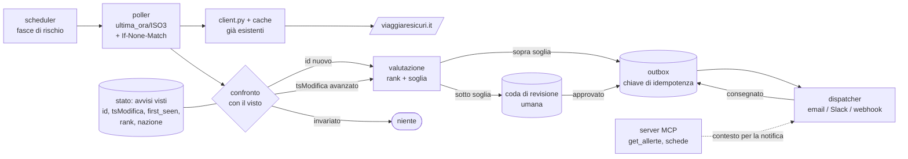

# Agente proattivo — prima versione del design

Superata da [PROACTIVE_AGENT.md](../PROACTIVE_AGENT.md), che la sostituisce dopo il censimento degli
avvisi del 16 settembre 2026: gli aggiornamenti hanno id nuovi, `tsModifica` è una data redazionale,
`tipologia` non distingue gli eventi naturali e `totale.json` basta come feed. Resta qui come traccia
del ragionamento.

L'assistente risponde quando gli si chiede qualcosa. L'agente proattivo fa la domanda opposta:
*è successo qualcosa che qualcuno deve sapere anche se non l'ha chiesto?* Il caso d'uso è il
customer care che ha clienti in partenza o già a destinazione: quando la Farnesina pubblica un
avviso su un Paese dove c'è una pratica aperta, qualcuno deve saperlo senza aprire il sito.

**Cosa fa:** sorveglia gli avvisi, riconosce quali sono nuovi, decide quali meritano una notifica
e la recapita una volta sola. **Cosa non fa:** non risponde a domande, non riassume, non decide
per conto dell'operatore. La risposta resta il mestiere dell'assistente già costruito.

## Architettura

Due proprietà da notare. Il poller non parla con la rete: passa dal client già esistente, quindi
eredita timeout, retry, cache e il fatto che una fonte irraggiungibile non produce un crash. E
l'outbox sta **fra** la decisione e l'invio: si decide di notificare scrivendo una riga, non
chiamando un servizio.

## Scheduling a fasce di rischio

Il polling uniforme su 222 Paesi è lo schema sbagliato: tratta la Svizzera come l'Ucraina, e
sceglie una frequenza che è troppo alta per quasi tutti e troppo bassa per i pochi che contano.

| Fascia | Chi ci finisce | Cadenza |
|---|---|---|
| calda | Paesi con avvisi attivi, o con una pratica cliente aperta nei prossimi 30 giorni | 5 minuti |
| tiepida | Paesi con un avviso chiuso di recente, o confinanti con un Paese caldo | 1 ora |
| fredda | tutto il resto | 12 ore |

La fascia è uno stato calcolato, non una lista scritta a mano: un Paese entra in "calda" da solo
quando compare un avviso, e ci resta finché l'avviso è attivo più una finestra di coda. Il
fattore che pesa di più è quello esterno — se non c'è nessun cliente diretto in un Paese, quel
Paese non ha bisogno di 5 minuti di risoluzione.

**La rivalidazione condizionale rende il conto sostenibile.** La fonte espone `ETag` e
`Last-Modified` e risponde `304` a zero byte (misurato, vedi [DISCOVERY.md](DISCOVERY.md)): un
giro completo su 222 Paesi costa 222 round-trip e praticamente nessun byte. È già implementata
nel client (ADR 3), quindi il poller la eredita invece di dovercela aggiungere. E qui non è
un'ottimizzazione: senza, un poller a 5 minuti scaricherebbe payload interi per sempre, e la
ragione etica dell'ADR 4 verrebbe meno proprio nel componente che genera più traffico.

## Rilevamento: quasi tutto lo dà già la fonte

Questa è la parte in cui la discovery paga, e va detta per quello che è — **riconoscere che la
primitiva esiste già è una scelta di design, non un pezzo mancante.**

Ogni voce di `ultima_ora/{ISO3}.json` porta:

- **`id` stabile** (`ULTIMORA_MARKER_35404`): è la chiave di deduplica naturale. Non serve
  costruire fingerprint sul testo, né hashing semantico, né similarità fra avvisi.
- **`tsModifica`**: distingue *avviso nuovo* da *avviso aggiornato*. `id` mai visto → nuovo;
  `id` noto con `tsModifica` avanzato → aggiornamento; entrambi invariati → niente.
- **`tipologia`**: la categoria assegnata dalla fonte (`sicurezza`, `sanita` nei campioni). Si usa
  com'è. Reinventare una tassonomia sopra quella del Ministero significherebbe introdurre un
  disaccordo fra ciò che dice il sito e ciò che dice il sistema, senza nessun guadagno.

Lo stato da persistere è quindi minuscolo: `(id, nazione, tsModifica, tipologia, first_seen,
rank_notificato)`. Una tabella, nella stessa SQLite che ospita già la cache.

**Quello che la fonte non dà è la gravità.** `tipologia` è una categoria, non una scala: "sicurezza"
copre sia un'allerta terrorismo sia uno sciopero dei trasporti. La gravità va quindi derivata, e la
scelta è fra due strade: una mappa ordinata mantenuta a mano — poche righe, verificabile,
sbagliata in modo prevedibile — oppure un classificatore. La prima è quella giusta per partire; la
seconda è l'unico punto di tutto il progetto dove un LLM guadagnerebbe davvero il suo costo, e
andrebbe introdotta **sotto revisione umana**, non in linea.

## Deduplica residua: si riallerta solo in salita

Con `id` e `tsModifica` la deduplica esatta è risolta. Resta il caso fastidioso: lo stesso avviso
che viene ritoccato più volte — una correzione di refuso, un paragrafo aggiunto — e che con la
regola ingenua "tsModifica avanzato → notifica" produrrebbe quattro notifiche per un evento.

**Regola: escalation-only.** Un avviso già notificato genera una seconda notifica solo se il suo
rank di gravità **sale** rispetto a quello con cui era stato notificato (`rank_notificato`). Un
aggiornamento che non alza il rank aggiorna lo stato in silenzio. La chiusura di un avviso non
produce un allarme: al massimo una riga nel digest.

La conseguenza scomoda va accettata consapevolmente: un aggiornamento importante che non cambia
categoria non riallerta. È il prezzo per non addestrare gli operatori a ignorare le notifiche, che
è il modo in cui questi sistemi muoiono davvero.

## Falsi positivi e controllo del volume

Tre freni, in ordine di quanto sono grossolani:

1. **Soglia di confidenza.** Si notifica solo sopra una soglia sul rank. Sotto soglia l'avviso non
   sparisce: finisce in **coda di revisione umana**, dove un operatore lo promuove o lo scarta. La
   coda è anche il modo per accorgersi che la soglia è tarata male, perché ciò che viene promosso a
   mano è il segnale che la regola sbaglia.
2. **Tetto per Paese al giorno.** Oltre N notifiche per Paese in 24 ore si passa a digest: una sola
   comunicazione che le raggruppa. Protegge dal caso peggiore — una crisi che genera venti
   aggiornamenti in un pomeriggio — che è esattamente il momento in cui le notifiche singole
   diventano rumore.
3. **Finestra di quiete.** Nessuna notifica non critica fuori dall'orario di lavoro del team.

La direzione dell'errore è dichiarata: si preferisce un falso positivo a un falso negativo, perché
un avviso di troppo costa un minuto e un avviso mancato costa un cliente in un Paese sbagliato.
Ma senza i tre freni "preferisco i falsi positivi" diventa un canale che nessuno legge, e a quel
punto i falsi negativi tornano tutti.

## Notifica: outbox con chiave di idempotenza

Decidere di notificare e notificare sono due operazioni diverse, e il punto debole è sempre il
secondo: il dispatcher va in timeout dopo che l'email è partita, il processo riparte, l'avviso
viene mandato due volte.

**Outbox pattern.** La decisione scrive una riga in una tabella `outbox` nella stessa transazione
che aggiorna lo stato degli avvisi visti: o sono atomiche entrambe, o nessuna delle due. Un
dispatcher separato legge le righe non consegnate, invia, e marca. La chiave di idempotenza è
`(id_avviso, tsModifica, destinatario, rank)` — deterministica, ricostruibile, e già unica per
costruzione: un retry dopo un crash ricalcola la stessa chiave, il canale la riconosce e non
duplica.

Il contenuto della notifica non è il testo grezzo della fonte: è titolo, Paese, data, categoria,
un estratto, il link alla scheda e **il PDF di una pagina con i recapiti consolari**, che è quello
che un operatore inoltra al cliente. Quel contenuto si compone chiamando i tool MCP già esistenti.

## Come lo misurerei

Senza queste tre misure il sistema non è governabile, perché ogni parametro — soglia, cadenza,
tetto — è una scommessa.

| Metrica | Definizione | Come si raccoglie |
|---|---|---|
| **Precision** | quota di notifiche giudicate utili da chi le riceve | un pollice su/giù nella notifica; è l'unico giudice che conta |
| **Time-to-detect** | `first_seen` meno `tsModifica` dell'avviso | già calcolabile dallo stato, senza strumentazione aggiuntiva |
| **Duplicati soppressi** | aggiornamenti visti che non hanno generato notifica | contatore sulla regola escalation-only |

Precision misura se il sistema è credibile, time-to-detect se serve a qualcosa, i duplicati
soppressi se la regola di deduplica sta lavorando o sta solo nascondendo cose. Le tre vanno lette
insieme: precision alta con time-to-detect di sei ore vuol dire che si notificano cose vere e
inutili; time-to-detect basso con precision bassa vuol dire che si è diventati rumore.

Una quarta misura andrebbe raccolta ma non può essere automatica: gli **avvisi rilevanti mai
notificati**, che si scoprono solo quando un operatore li trova da sé. Vale la pena tenere un
campo per registrarli a mano.

## Cosa riusa del sistema già costruito

- **[client.py](../../viaggiaresicuri_mcp/client.py)**: timeout, retry con backoff, lock per URL,
  traduzione degli errori. Il poller non aggiunge una riga di rete.
- **[cache.py](../../viaggiaresicuri_mcp/cache.py)**: lo stesso store SQLite ospita la tabella degli
  avvisi visti e l'outbox, e la semantica stale-if-error vale anche qui — una fonte giù non deve
  produrre né allarmi né silenzio non dichiarato.
- **`get_allerte` e i tool sulla scheda**: il contenuto della notifica si compone con gli stessi
  tool che usa l'assistente, quindi non esistono due normalizzazioni da tenere allineate.
- **I tre stati degli avvisi**: `non_verificabile` vale anche per l'agente. Se la fonte non
  risponde, "nessun avviso nuovo" è indistinguibile da "non ho potuto guardare", e il secondo caso
  dopo N cicli consecutivi deve diventare un allarme sul sistema, non un silenzio.

Il pezzo che manca è solo la persistenza del "già visto": una tabella e la query di diff.

## Il limite noto

**La fonte ufficiale è lenta.** I `tsModifica` reali mettono gli avvisi sulla scala delle
settimane. La Farnesina pubblica dopo aver verificato, ed è giusto che sia così — ma significa che
un agente costruito solo su questa fonte scopre una crisi ore dopo che è nei telegiornali. Il
time-to-detect rispetto alla *pubblicazione* sarà ottimo; rispetto all'**evento** no, e la
distinzione va detta a chi usa il sistema.

In produzione affiancherei un segnale più rapido — feed di agenzie, avvisi di aviazione civile,
allerte meteo, sorveglianza epidemiologica — usato **solo** per anticipare l'attenzione: alzare un
Paese di fascia, avvisare il team che qualcosa si sta muovendo. La comunicazione al cliente
continuerebbe a citare l'autorità: la Farnesina resta la fonte di verità, e nessuna notifica
attribuirebbe mai a viaggiaresicuri.it qualcosa che viaggiaresicuri.it non ha ancora scritto. È lo
stesso principio dell'assistente: la velocità si può prendere altrove, l'autorevolezza no.
